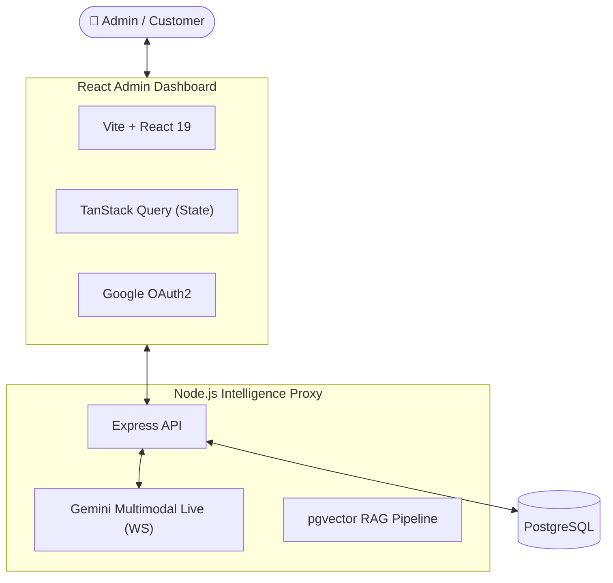

# TrekDesk AI - Full Stack Tour Intelligence

TrekDesk AI is an enterprise-grade platform for B2B tour operators. It combines a real-time **Multimodal Voice AI agent** with a powerful **Administrative Dashboard** to streamline bookings, automate customer service, and manage proprietary knowledge.



---

## 🏗️ Project Structure

The repository is organized into two primary sub-projects:

- **[trekdesk-admin-dashboard/](./trekdesk-admin-dashboard)**: A high-performance React SPA for managing treks, viewing call logs, and configuring AI settings.
- **[trekdesk-backend-prod/](./trekdesk-backend-prod)**: The core intelligence layer handling REST APIs, WebSocket voice sessions, and vector search.

---

## 🚀 Quick Start (Development)

To run the full stack locally, you will need two terminal instances.

### 1. Prerequisites

- **Node.js** (v20+)
- **PostgreSQL** with the `pgvector` extension.
- **Google AI Studio API Key** (for Gemini 2.0).
- **Google Cloud Console Credentials** (for OAuth).

### 2. Backend Setup

```bash
cd trekdesk-backend-prod
npm install
cp .env.example .env  # Update variables (DB_URL, GEMINI_KEY, etc.)
npm run migrate:up    # Scaffold database
npm run dev           # Port 3001
```

### 3. Frontend Setup

```bash
cd trekdesk-admin-dashboard
npm install
cp .env.example .env  # Update VITE_API_URL and GOOGLE_CLIENT_ID
npm run dev           # Port 5173
```

---

## 🛠️ Tech Stack

### Frontend

- **Framework**: React 19 + Vite
- **Architecture**: Feature-based Vertical Slices
- **State**: TanStack Query (Server), Zustand (UI), Context (Auth)
- **Styling**: Vanilla CSS + PostCSS
- **Validation**: Zod

### Backend

- **Framework**: Node.js + Express
- **Architecture**: Layered Dependency Inversion (Controller -> Service -> Repository)
- **AI**: Google Gemini Multimodal Live API (WebSockets)
- **Vector DB**: PostgreSQL + `pgvector`
- **Validation**: Zod DTOs

---

## 📚 Documentation

Detailed documentation is available within each sub-directory:

### Frontend Docs

- [Architecture & Features](./trekdesk-admin-dashboard/docs/ARCHITECTURE.md)
- [Authentication Flow](./trekdesk-admin-dashboard/docs/AUTH_FLOW.md)
- [AI Persona Feature](./trekdesk-admin-dashboard/docs/AI_PERSONA.md)
- [Conversations Feature](./trekdesk-admin-dashboard/docs/Conversations.md)
- [Hooks Reference](./trekdesk-admin-dashboard/docs/hooks/HOOKS.md)

### Backend Docs

- [01 System Architecture](./trekdesk-backend-prod/docs/01_System_Architecture.md)
- [02 Authentication Flow](./trekdesk-backend-prod/docs/02_Authentication_Flow.md)
- [03 Real-time Voice AI](./trekdesk-backend-prod/docs/03_Realtime_Voice_AI.md)
- [04 Conversation & Call Log Flow](./trekdesk-backend-prod/docs/04_Conversation_and_Call_Log_Flow.md)
- [05 RAG Pipeline](./trekdesk-backend-prod/docs/05_RAG_Pipeline.md)
- [06 Database Schema](./trekdesk-backend-prod/docs/06_Database_Schema.md)
- [07 Development Workflow](./trekdesk-backend-prod/docs/07_Development_Workflow.md)
- [08 Cloud SQL Setup](./trekdesk-backend-prod/docs/08_Cloud_SQL_Setup.md)
- [09 API Reference](./trekdesk-backend-prod/docs/09_API_Reference.md)

---

## 🔒 Security & Environment

Ensure your `.env` files are never committed. Both layers verify origin headers and enforce strict JWT-based session security for all administrative actions.
