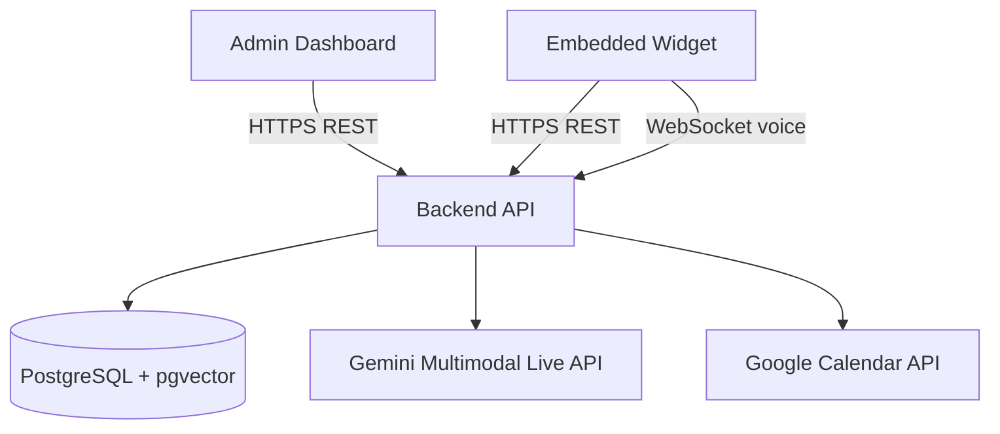
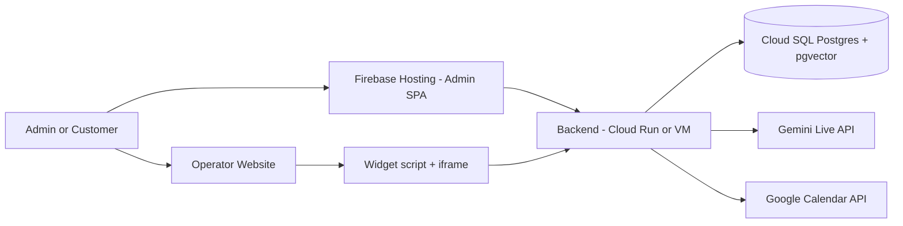
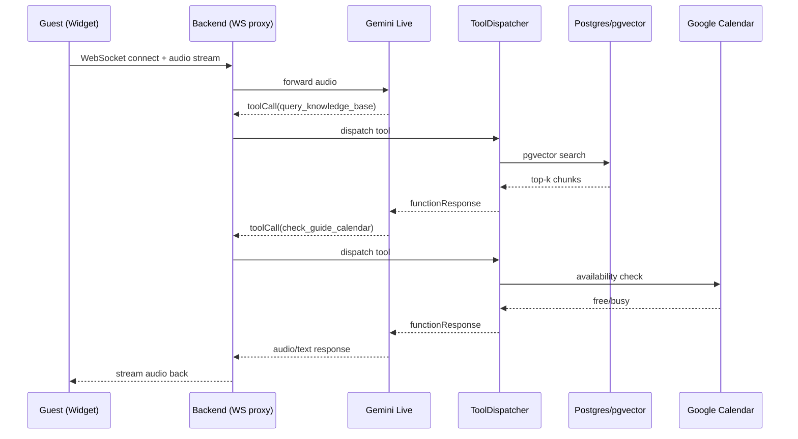

# TrekDesk AI — Full Stack Tour Intelligence

TrekDesk AI is a full-stack platform for trekking tour operators: an admin dashboard for configuration and analytics, plus a real-time voice AI system (Gemini Multimodal Live over WebSockets) with RAG (pgvector) and Google Calendar availability checks.

## System Overview



## Repository Layout

- `trekdesk-admin-dashboard/` — React admin dashboard (Vite) + voice playground (VAD + playback)
- `trekdesk-backend-prod/` — Node.js/Express backend (REST + WebSockets), tool calling, RAG, Calendar integration
- `setup.ps1`, `setup.sh` — one-time setup helpers (install deps + create `.env` from `.env.example`)

## Quick Start (Local Development)

### 1) One-time setup

Windows:

- `npm run setup` (runs `setup.ps1`)

macOS/Linux:

- `bash setup.sh`

Then edit:

- `trekdesk-backend-prod/.env`
- `trekdesk-admin-dashboard/.env`

### 2) Database

- PostgreSQL with `pgvector` enabled.
- Run migrations: `cd trekdesk-backend-prod; npm run migrate:up`
- Cloud SQL Proxy guide: `trekdesk-backend-prod/docs/CLOUD_SQL_SETUP.md`

### 3) Run backend

```bash
cd trekdesk-backend-prod
npm run dev
```

### 4) Run frontend

```bash
cd trekdesk-admin-dashboard
npm install
node scripts/sync-vad-assets.js
npm run dev
```

### Local Ports (defaults)

- Backend: `http://localhost:3500` (from `trekdesk-backend-prod/.env.example` `PORT=3500`)
- Frontend dev server: `http://localhost:5173` (Vite default)
- Frontend → Backend API: `VITE_API_URL=http://localhost:3500/api/v1` (from `trekdesk-admin-dashboard/.env.example`)

## Major Functionality

- **Admin authentication:** Google OAuth on frontend; backend verifies Google ID token and issues JWT (MVP can restrict by whitelist).
- **Tours:** CRUD trekking itineraries and tiered pricing.
- **Knowledge Base (RAG):** ingest content → embeddings → pgvector search used during tool calls.
- **Real-time voice:** full-duplex streaming via backend WebSocket proxy to Gemini Live API.
- **Tool calling:** Gemini requests backend tools during a live session (quote generation, knowledge search, booking, calendar checks).
- **Calendar availability:** Google Calendar API integration used by tool calls to answer date availability.
- **Widget embedding:** static loader + backend embed wrapper URL + origin/domain locking.
- **Analytics:** call logs, transcripts, summaries, and dashboard KPIs.
- **Diagnostics:** dev-only sandbox and tool trace viewer.

## Models & Voice Stack

Backend models are configured in `trekdesk-backend-prod/.env` (see `trekdesk-backend-prod/.env.example`):

- **Realtime voice model:** `GEMINI_MODEL_NAME=models/gemini-2.5-flash-native-audio-preview-12-2025`
- **Embeddings model:** `GEMINI_EMBEDDING_MODEL=models/gemini-embedding-001`

Frontend voice stack:

- VAD: `@ricky0123/vad-web`
- Runtime: `onnxruntime-web`
- Assets: `trekdesk-admin-dashboard/scripts/sync-vad-assets.js` syncs ONNX + worklet files into `trekdesk-admin-dashboard/public/vad`

## Google Services & Packages

Frontend:

- Google Identity/OAuth: `@react-oauth/google`

Backend:

- Gemini SDKs: `@google/genai`, `@google/generative-ai`
- Google OAuth verification: `google-auth-library`
- Google Calendar: `@googleapis/calendar`
- Swagger/OpenAPI: `swagger-jsdoc`, `swagger-ui-express` (served at `/api-docs`)

## Where to Find Docs

Start with the docs indexes:

- Frontend docs: `trekdesk-admin-dashboard/docs/README.md`
- Backend docs: `trekdesk-backend-prod/docs/README.md`

High-value entrypoints:

- Frontend architecture: `trekdesk-admin-dashboard/docs/ARCHITECTURE.md`
- Frontend voice: `trekdesk-admin-dashboard/docs/VOICE_ARCHITECTURE.md`
- Backend architecture: `trekdesk-backend-prod/docs/ARCHITECTURE.md`
- Backend voice: `trekdesk-backend-prod/docs/REALTIME_VOICE_AI.md`
- Backend RAG: `trekdesk-backend-prod/docs/RAG_PIPELINE.md`
- Backend API docs: `trekdesk-backend-prod/docs/API_REFERENCE.md` (Swagger UI)

## Dev vs Prod Notes

- Backend:
  - `NODE_ENV=development` enables developer endpoints under `/api/v1/dev`.
  - Widget embed wrapper uses `FRONTEND_URL` in production, and defaults to `http://localhost:5173` in development.
  - Rate limiting is enabled for `/api` and stricter limits for `/api/v1/auth` (see `trekdesk-backend-prod/src/app.ts`).
- Frontend:
  - Dev uses Vite dev server; production is a static build deployed to Firebase Hosting.
  - VAD requires assets synced into `trekdesk-admin-dashboard/public/vad` via `node scripts/sync-vad-assets.js`.

## Cloud SQL Connection

- Use Cloud SQL Auth Proxy + ADC (step-by-step): `trekdesk-backend-prod/docs/CLOUD_SQL_SETUP.md`

## Firebase Deployment (Admin Dashboard)

Frontend is configured for Firebase Hosting:

- Config: `trekdesk-admin-dashboard/firebase.json`, `trekdesk-admin-dashboard/.firebaserc`
- Build: `cd trekdesk-admin-dashboard; npm run build`
- Deploy: `firebase deploy` (requires Firebase CLI + login)

## Live URLs (Production)

- Frontend (Firebase Hosting): `https://trekdesk.web.app/`
- Backend (Cloud Run): `https://trekdesk-backend-1525120942.us-central1.run.app`

## Docker (Backend)

- Dockerfile: `trekdesk-backend-prod/Dockerfile` (multi-stage TypeScript build → Node.js runtime; serves `dist/` and `static/`)

## Production Topology (Typical)



## End-to-End Request (Widget Voice)


