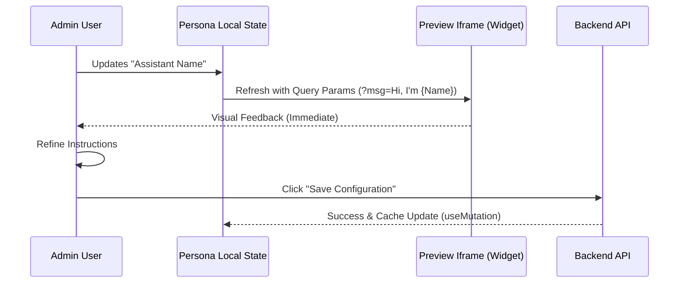

# AI Persona Feature

## Overview

The **AI Persona** feature is the core configuration engine for the TrekDesk AI assistant. It allows administrators to define the AI's identity, conversational style, and system-level constraints. This feature ensures that the AI aligns with the tour operator's brand voice and follows specific business rules during customer interactions.

---

## 🏗️ Architecture & Component Design

The AI Persona page is designed for high observability, providing a real-time feedback loop between configuration changes and the resulting customer experience.

### Component Structure

| Component                 | Responsibility                                                                                 |
| :------------------------ | :--------------------------------------------------------------------------------------------- |
| `Persona.tsx`             | Main page container. Handles the layout grid and orchestrates the live preview data injection. |
| `VoicePlayground.tsx`     | A modal-based interface for selecting and testing high-fidelity voices for the AI.             |
| `Card`, `Badge`, `Button` | Standard UI primitives ensuring a consistent brand aesthetic.                                  |

### Visual Layout

The interface uses a **Balanced Columnar Layout**:

1.  **Identity Configuration (Left)**: Inputs for the Assistant Name and System Instructions.
2.  **Live Visual Preview (Right)**: A "Phone Mockup" containing a live iframe of the actual customer-facing chat widget.

---

## 🔄 Data Flow & Preview Logic

The AI Persona feature implements a specialized "Preview Bridge" to show changes before they are committed to the database.

### Real-time Preview Sequence

---

## ⚙️ Data Lifecycle (TanStack Query)

The feature utilizes advanced caching strategies to ensure a responsive administrative experience.

### 1. Fetching (`usePersonaSettings`)

- **Key**: `["persona", "settings"]`
- **Behavior**: Uses a `staleTime` of 5 minutes to prevent redundant network requests when switching between tabs.

### 2. Updating (`useUpdatePersonaSettings`)

- **Strategy**: **Optimistic Cache Update**.
- On a successful mutation, the hook uses `queryClient.setQueryData()` to manually update the local cache with the record returned from the server.
- This eliminates the "loading flicker" associated with full query invalidations, making the app feel like a local desktop application.

---

## 🎙️ Voice & Sound Integration

Beyond text instructions, the feature includes a **Voice Studio** extension:

- Administrators can browse available vocal profiles.
- Changes made in the Voice Studio modal are immediately reflected in the AI's real-time voice sessions via the `GeminiService` on the backend.

## 🛠️ Implementation Details

### Instruction Normalization

The system instructions are piped directly into the **Gemini Multimodal Live API** setup parameters. This allows the model to instantly adopt the persona defined by the admin without needing a retraining or fine-tuning phase.

### Styling Logic

Scoped CSS Modules (`Persona.module.css`) are used to manage the complex grid transitions and the interactive phone mockup effect, ensuring styles do not leak into other parts of the dashboard.
