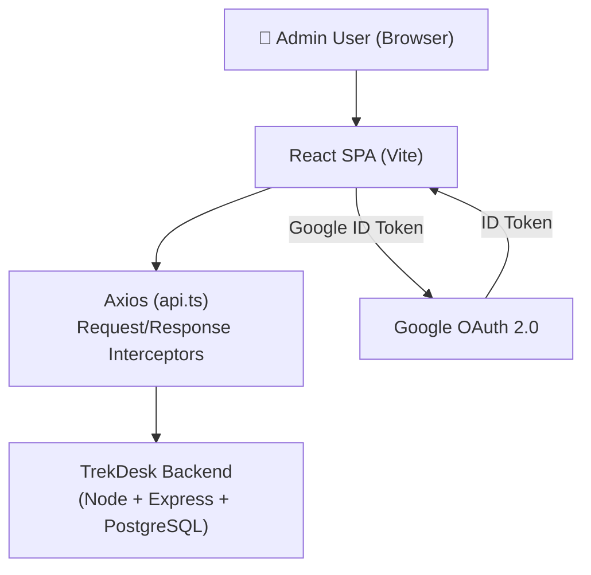
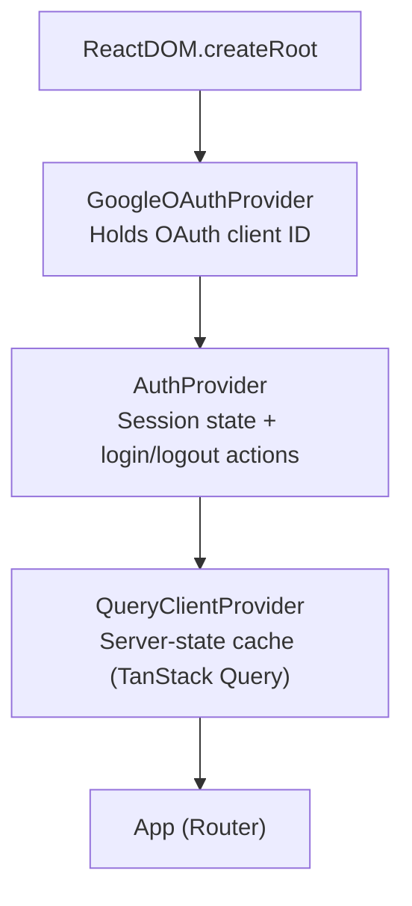
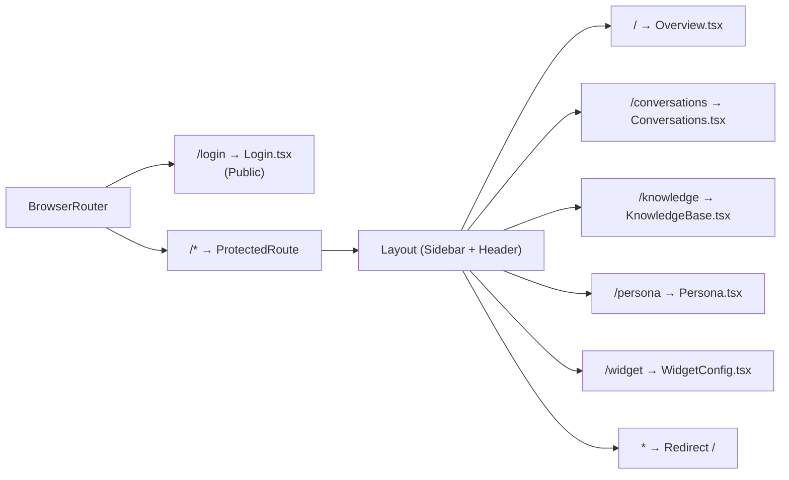
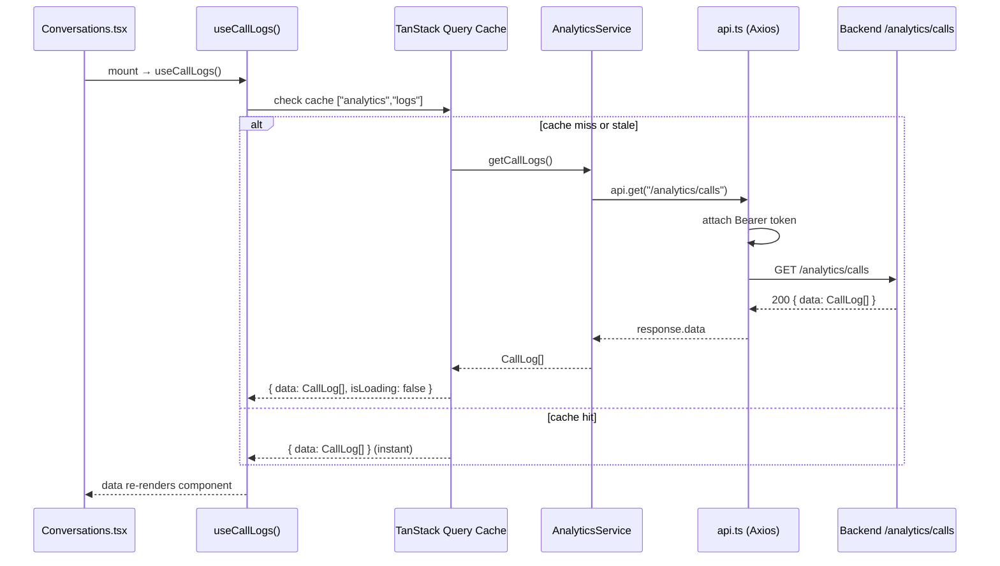

# Architecture

## Overview

TrekDesk AI Admin Dashboard is a **single-page React application** built with Vite. It communicates with a REST backend over HTTPS, using Axios for all HTTP requests.

---

## Provider Tree

The application is bootstrapped in `main.tsx` with three providers wrapping `App`. The provider order is significant:

1. **GoogleOAuthProvider** — must be outermost; `AuthProvider` calls Google hooks.
2. **AuthProvider** — must wrap `QueryClientProvider` (so auth state is available to query hooks).
3. **QueryClientProvider** — injected with the shared singleton `queryClient` from `lib/queryClient.ts`.

---

## Routing Architecture

All routes are defined in `App.tsx` using React Router v7. Pages are **lazy-loaded** via `React.lazy()` to minimize the initial JS bundle.

### Route Table

| Path             | Component           | Protected | Description                              |
| ---------------- | ------------------- | --------- | ---------------------------------------- |
| `/login`         | `Login.tsx`         | No        | Google OAuth + dev secret login          |
| `/`              | `Overview.tsx`      | Yes       | Dashboard home (call stats, recent logs) |
| `/conversations` | `Conversations.tsx` | Yes       | Call log list + transcript viewer        |
| `/knowledge`     | `KnowledgeBase.tsx` | Yes       | RAG ingestion + semantic search          |
| `/persona`       | `Persona.tsx`       | Yes       | AI persona and system prompt editor      |
| `/widget`        | `WidgetConfig.tsx`  | Yes       | Widget embed customizer                  |
| `/*`             | Redirect to `/`     | Yes       | Unmatched paths for auth'd users         |

---

## Directory Guide

| Directory                | Role                                                                                 |
| ------------------------ | ------------------------------------------------------------------------------------ |
| `src/pages/`             | One component per route. Consumes hooks and renders the data view.                   |
| `src/components/ui/`     | Primitive design-system components (Button, Card, Input, Badge). Framework-agnostic. |
| `src/components/shared/` | App-wide utility components (e.g. ErrorBoundary).                                    |
| `src/components/`        | Layout-wired components: Header, Sidebar, ProtectedRoute.                            |
| `src/layouts/`           | Layout shell: renders Sidebar + Header + page outlet.                                |
| `src/hooks/`             | TanStack Query wrappers. One file per domain.                                        |
| `src/services/`          | Axios call functions. Knows nothing about React or query state.                      |
| `src/context/`           | React Context: `AuthContext` + `useAuth` hook.                                       |
| `src/store/`             | Zustand stores for purely client-side UI state.                                      |
| `src/lib/`               | Framework-agnostic utility code: query client, error class, validators.              |
| `src/types/`             | TypeScript interfaces mirroring backend schemas.                                     |

---

## Data Flow (Example: Loading Call Logs)

