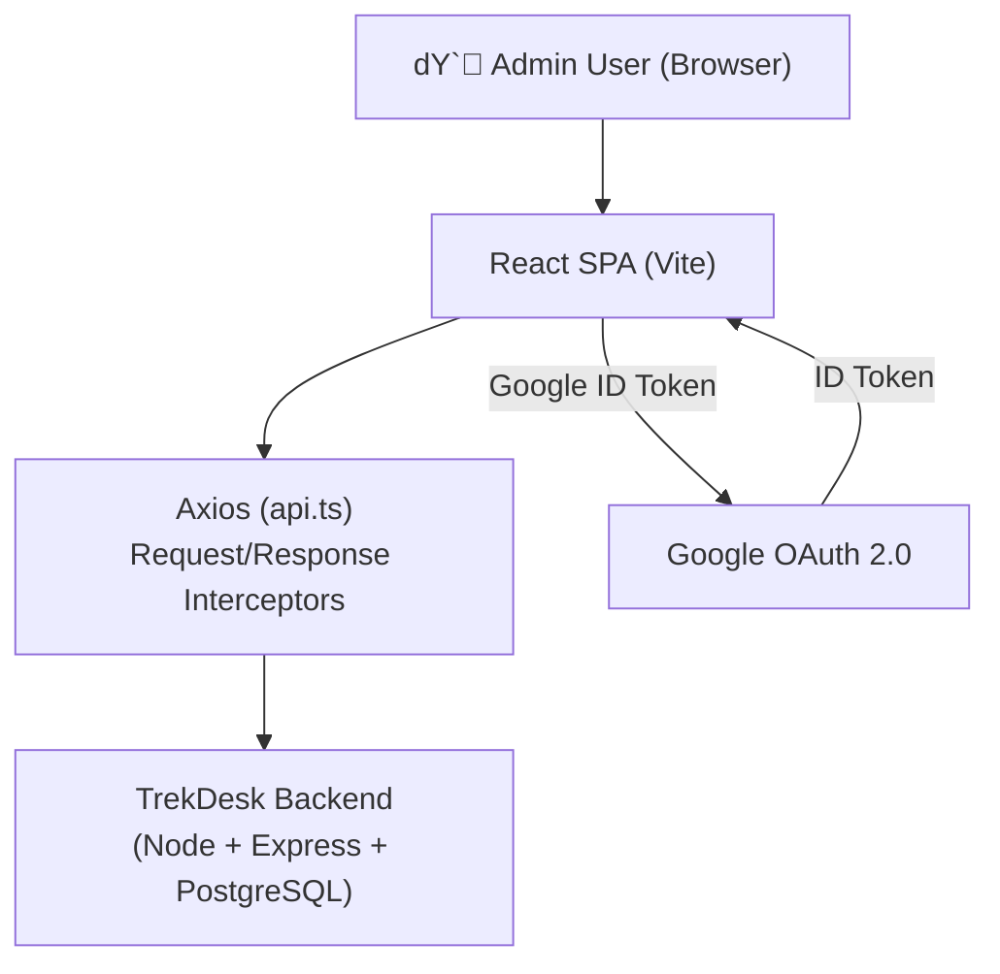
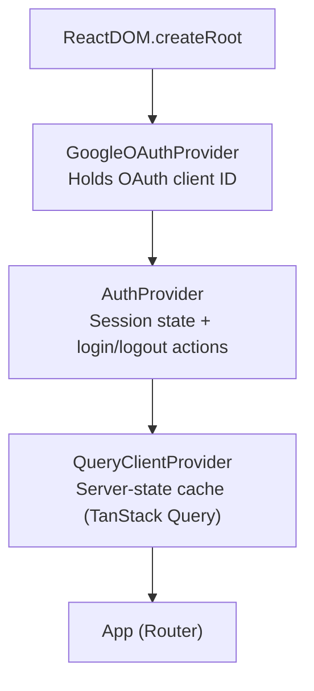
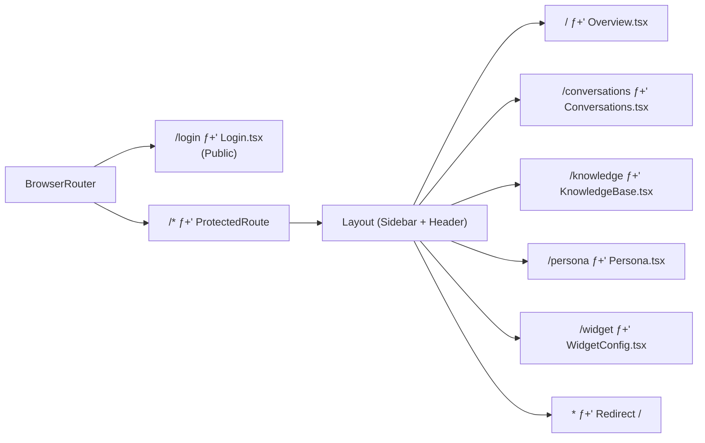
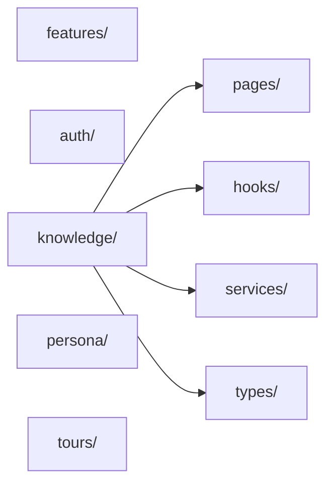
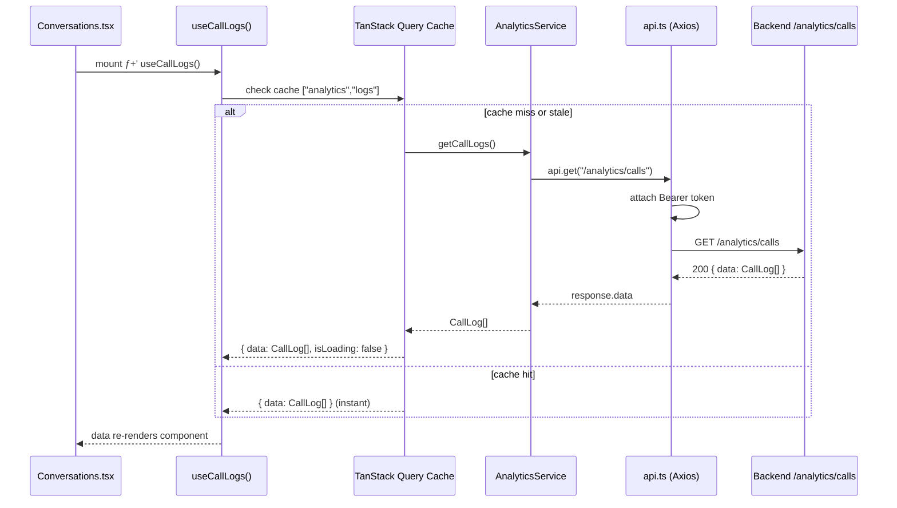

# Architecture

## Overview

TrekDesk AI Admin Dashboard is a **single-page React application** built with Vite. It communicates with a REST backend over HTTPS, using Axios for all HTTP requests.

---

## Reference Map

- State model: `STATE_MANAGEMENT.md`
- Validation patterns: `VALIDATION.md`
- Testing stack: `TESTING.md`
- Feature guides: `features/FEATURE_*.md`
- Voice subsystem: `VOICE_ARCHITECTURE.md`

---

## Provider Tree

The application is bootstrapped in `main.tsx` with three providers wrapping `App`. The provider order is significant:

1. **GoogleOAuthProvider** ƒ?" must be outermost; `AuthProvider` calls Google hooks.
2. **AuthProvider** ƒ?" must wrap `QueryClientProvider` (so auth state is available to query hooks).
3. **QueryClientProvider** ƒ?" injected with the shared singleton `queryClient` from `lib/queryClient.ts`.

---

## Routing Architecture

All routes are defined in `App.tsx` using React Router v7. Pages are **lazy-loaded** via `React.lazy()` to minimize the initial JS bundle.

### Route Table

| Path             | Component           | Protected | Description                              |
| ---------------- | ------------------- | --------- | ---------------------------------------- |
| `/login`         | `Login.tsx`         | No        | Google OAuth + dev secret login          |
| `/`              | `Overview.tsx`      | Yes       | Dashboard home (call stats, recent logs) |
| `/conversations` | `Conversations.tsx` | Yes       | Call log list + transcript viewer        |
| `/knowledge`     | `KnowledgeBase.tsx` | Yes       | RAG ingestion + semantic search          |
| `/persona`       | `Persona.tsx`       | Yes       | AI persona and system prompt editor      |
| `/widget`        | `WidgetConfig.tsx`  | Yes       | Widget embed customizer                  |
| `/*`             | Redirect to `/`     | Yes       | Unmatched paths for auth'd users         |

---

## Directory Guide

| Directory                    | Role                                                                                              |
| ---------------------------- | ------------------------------------------------------------------------------------------------- |
| `src/features/`              | **The heart of the app.** Domain-specific logic grouped by feature (e.g. `knowledge`, `persona`). |
| `src/features/[f]/pages/`    | One component per route. Consumes feature-specific hooks and renders the data view.               |
| `src/features/[f]/hooks/`    | TanStack Query wrappers for this feature's domain.                                                |
| `src/features/[f]/services/` | Axios call functions for this feature's domain.                                                   |
| `src/features/[f]/types/`    | TypeScript interfaces mirroring backend schemas for this feature.                                 |
| `src/components/ui/`         | Primitive design-system components (Button, Card, Input, Badge). Framework-agnostic.              |
| `src/components/shared/`     | App-wide utility components (e.g. ErrorBoundary).                                                 |
| `src/layouts/`               | Layout shell: renders Sidebar + Header + page outlet.                                             |
| `src/services/`              | Globalized services (e.g. `api.ts` Axios instance).                                               |
| `src/store/`                 | Zustand stores for purely client-side UI state.                                                   |
| `src/lib/`                   | Framework-agnostic utility code: query client, error class, validators.                           |
| `src/types/`                 | Cross-cutting TypeScript interfaces (e.g. generic API responses).                                 |

---

## Feature-Based Architecture

The dashboard uses a **Vertical Feature** structure. Instead of organizing files by technical role (e.g., all hooks in one folder), we organize them by business domain.

Each folder in `src/features/` is a self-contained module containing its own pages, components, hooks, and services. This makes the codebase easier to navigate and prevents "folder bloating" as the app grows.

---

---

## Data Flow (Example: Loading Call Logs)

---

## Feature Architecture Guides

- Voice interaction system: `VOICE_ARCHITECTURE.md`
- Feature guides: `features/FEATURE_TOURS.md`, `features/FEATURE_KNOWLEDGE.md`, `features/FEATURE_PERSONA.md`, `features/FEATURE_WIDGET.md`, `features/FEATURE_AUTH.md`, `features/FEATURE_CONVERSATIONS.md`, `features/FEATURE_DIAGNOSTICS.md`
