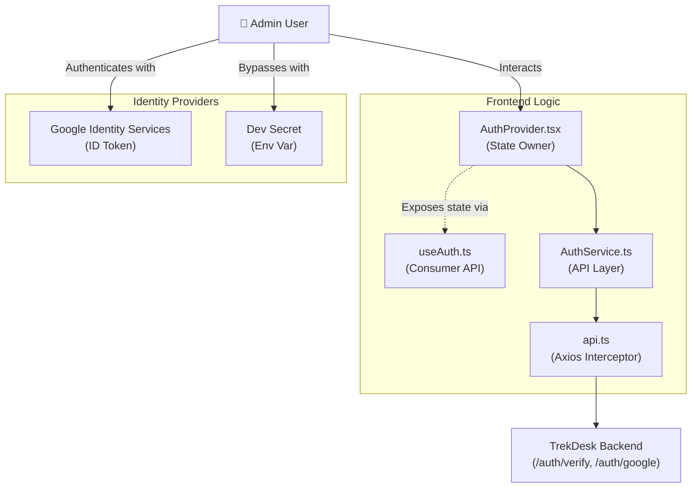
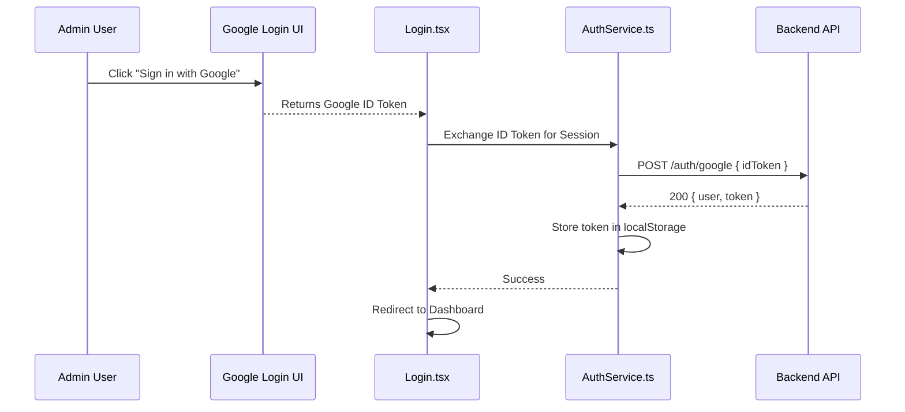
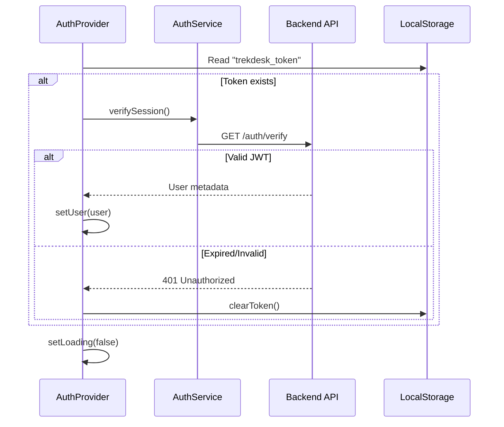

# Authentication System (TrekDesk AI Admin)

## Overview

The authentication system is a robust, production-grade implementation that balances security with seamless developer experience. It supports **Google OAuth 2.0** as the primary production identity provider and a **Dev Secret Bypass** for rapid local testing.

---

## 🏗️ Architecture

The authentication logic follows the **Vertical Feature Architecture**. All code related to identity management resides in `src/features/auth`.



---

## 📂 File Structure & Anatomy

| File                            | Responsibility                                                                                                  |
| :------------------------------ | :-------------------------------------------------------------------------------------------------------------- |
| `context/AuthContext.ts`        | **The Contract.** Defines the `AuthContextType` interface and creates the context object.                       |
| `providers/AuthProvider.tsx`    | **The Logic.** Manages state (`user`, `loading`, `error`), handles token exchange, and initializes sessions.    |
| `hooks/useAuth.ts`              | **The API.** A custom hook used by UI components to access authentication state.                                |
| `services/AuthService.ts`       | **The Network.** Standard functions for calling `/auth` endpoints. Handles token persistence in `localStorage`. |
| `components/ProtectedRoute.tsx` | **The Guard.** A wrapper component that redirects guests to `/login` and shows loading spinners.                |
| `pages/Login.tsx`               | **The UI.** The visual login portal featuring glassmorphism design and Google button integration.               |
| `types/auth.types.ts`           | **The Schema.** TypeScript interfaces for User objects, shared with the backend.                                |

---

## 🔄 User Flows

### 1. Google OAuth Authentication

The primary flow for administrators using their corporate Google account.



### 2. Session Initialization (On-Load)

When the app first loads, it attempts to restore the previous session silently.



---

## 🚨 Error Handling & Security

The system implements a centralized error handling strategy via **Axios Response Interceptors** in `src/services/api.ts`.

### Global Response Logic:

- **401 Unauthorized**: Automatically clears the local token and redirects the browser to `/login?expired=true`.
- **API Errors (Global)**: Automatically triggers a high-fidelity **Toast Notification** (unless suppressed).
- **Silent Errors (`x-skip-toast`)**: Some requests (like session verification or login attempts) use a custom header to suppress global toasts. This prevents "Double-Reporting" when the Login page already has its own error banner.

### Route Protection:

The `ProtectedRoute` component acts as a high-level router guard:

1.  **Prevents Flash of Unauthenticated Content**: Wait for `loading` to be false before rendering.
2.  **Breadcrumb Retention**: Saves the original destination in `location.state.from` so users return to their intended page after logging in.

---

## ⚙️ Environment Configuration

To operate correctly, the frontend requires the following variables in `.env`:

```bash
# Google Cloud Console client ID
VITE_GOOGLE_CLIENT_ID="[CLIENT_ID].apps.googleusercontent.com"

# Enable the Dev Secret bypass button
VITE_ENABLE_DEV_LOGIN="true"

# Backend Endpoint
VITE_API_URL="http://localhost:3001/api/v1"
```
