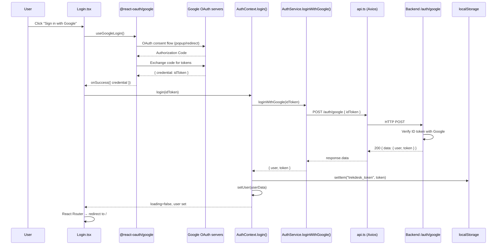
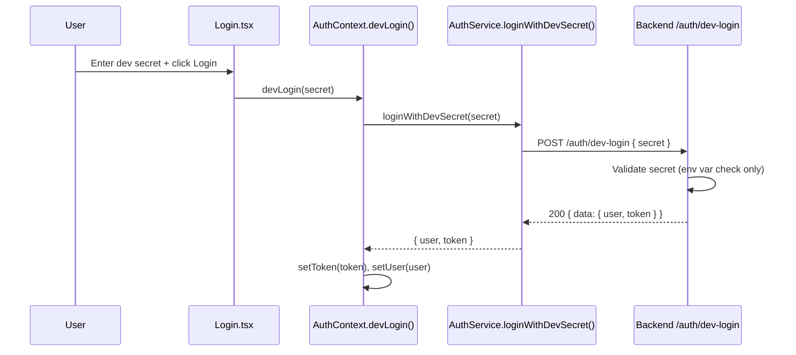
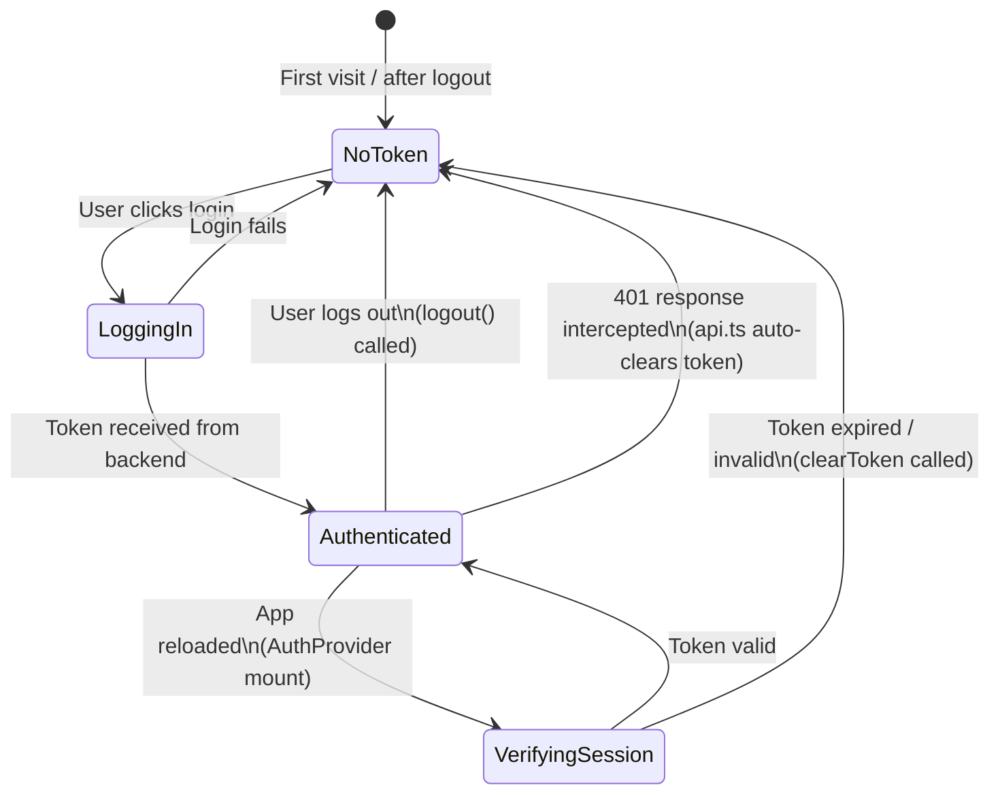
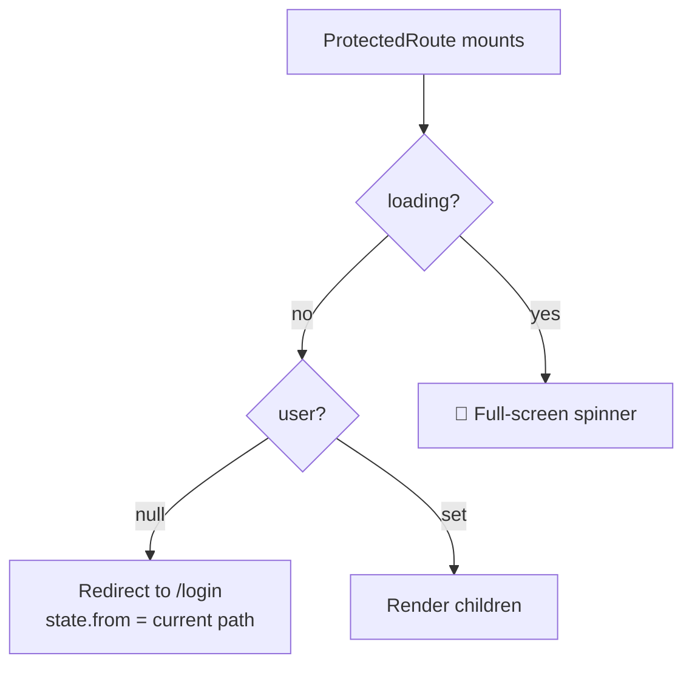

# Authentication Flow

## Overview

Two login modes are supported:

| Mode                  | Used In          | Flow                           |
| --------------------- | ---------------- | ------------------------------ |
| **Google OAuth**      | Production       | Google ID Token → Backend JWT  |
| **Dev Secret Bypass** | Development only | Plaintext secret → Backend JWT |

Both flows result in a backend-issued JWT, stored in `localStorage`, and attached to every subsequent API request via an Axios request interceptor.

---

## Google OAuth Login — Full Sequence



---

## Dev Secret Login — Sequence



> **Security note:** The dev-login endpoint is disabled at the backend level when `NODE_ENV=production`. The secret is never validated client-side.

---

## Token Lifecycle



### Token Storage

| Key              | Location       | Type                |
| ---------------- | -------------- | ------------------- |
| `trekdesk_token` | `localStorage` | Bearer JWT (string) |

The token is read by the **request interceptor** in `api.ts` on every API call:

```ts
api.interceptors.request.use((config) => {
  const token = localStorage.getItem("trekdesk_token");
  if (token && config.headers) {
    config.headers.Authorization = `Bearer ${token}`;
  }
  return config;
});
```

### 401 Auto-Logout

The **response interceptor** in `api.ts` handles 401 responses globally:

```ts
if (statusCode === 401) {
  localStorage.removeItem("trekdesk_token");
  if (!window.location.pathname.includes("/login")) {
    window.location.href = "/login?expired=true";
  }
}
```

This means any protected page that receives a 401 will automatically redirect the user to the login page with a `?expired=true` query param, which the Login page can use to show an "Your session has expired" message.

---

## ProtectedRoute Guard

`src/features/auth/components/ProtectedRoute.tsx` wraps all dashboard routes. It reads from `AuthContext` and:

1. **If `loading` is true** → Renders a full-screen spinner (prevents login-flash during session verification)
2. **If `user` is null** → Redirects to `/login`, preserving the original path in `location.state.from`
3. **If `user` is set** → Renders children



---

## Logout

Logout is entirely client-side — the backend JWT is _not_ invalidated on the server. This is an acceptable trade-off for a short-lived dashboard JWT (typical expiry: 24h).

```ts
// AuthContext.logout()
const logout = () => {
  AuthService.clearToken(); // removes trekdesk_token from localStorage
  setUser(null); // triggers ProtectedRoute → redirect
};
```
