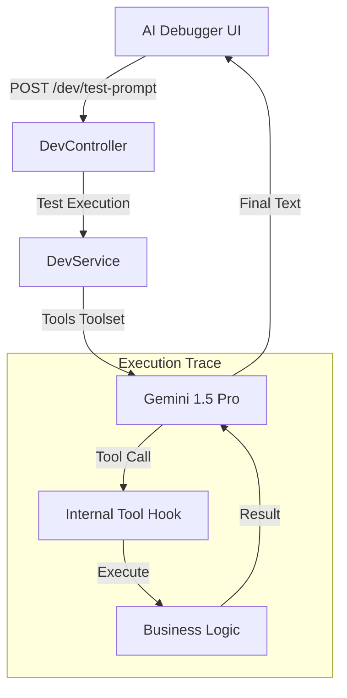

# AI Diagnostic & Debugging Tools

The TrekDesk Admin Dashboard includes a specialized **Execution Sandbox** (AI Debugger) designed to help developers and AI specialists test, tune, and verify the Multi-modal Live AI's logic without initiating a full voice or WebSocket session.

## Overview

The AI Debugger simulates a live conversation by sending natural language prompts directly to the backend's orchestration layer. It captures the full internal execution trace, including tool-calling decisions and raw service results.

## Key Features

### 1. Execution Sandbox

The primary interface for testing prompt engineering.

- **Ctrl+Enter:** Quick execution of prompts.
- **Real-time Feedback:** Displays the final generated text response from Gemini.

### 2. Logic Trace Execution

The most critical feature for debugging complex tool-calling flows. It displays a sequential timeline of:

- **Tool Calls:** What tool Gemini decided to call and with what arguments (args).
- **Tool Responses:** The raw data the backend returned to Gemini.

### 3. Guide Availability Preview

A diagnostic view of the primary Google Calendar associated with the trek guides.

- **Purpose:** Allows developers to verify if the AI's "is_busy" or "booking" logic matches the actual calendar state.
- **Interface:** A 7-day forecast showing "Busy" vs "Available" slots.

### 4. Registered AI Tools Registry

A dynamic catalog of every tool currently exposed to the AI model.

- **Schema Inspection:** View the JSON parameter schemas for each tool.
- **Required Fields:** Highlights which fields the AI must provide to successfully execute a tool.

---

## Technical Architecture

The debugger bypasses the Real-time/Voice layer to focus strictly on **Logic and Tools**.

## Relevant Files

- **Page:** `src/features/devtools/pages/AIDebugger.tsx`
- **Service:** `src/features/devtools/services/DevService.ts`
- **Styles:** `src/features/devtools/pages/AIDebugger.module.css`

## Testing Workflow

1. **Prompt Engineering:** Enter a question like _"Do you have any treks in Ella?"_.
2. **Verify Trace:** Ensure the `get_trek_details` tool was called with `location: "Ella"`.
3. **Check Result:** Confirm the final response accurately reflects the data returned by the tool.
4. **Availability Fixes:** If the AI incorrectly says a guide is free, check the **Availability Preview** to see if the Google Calendar sync is active.
