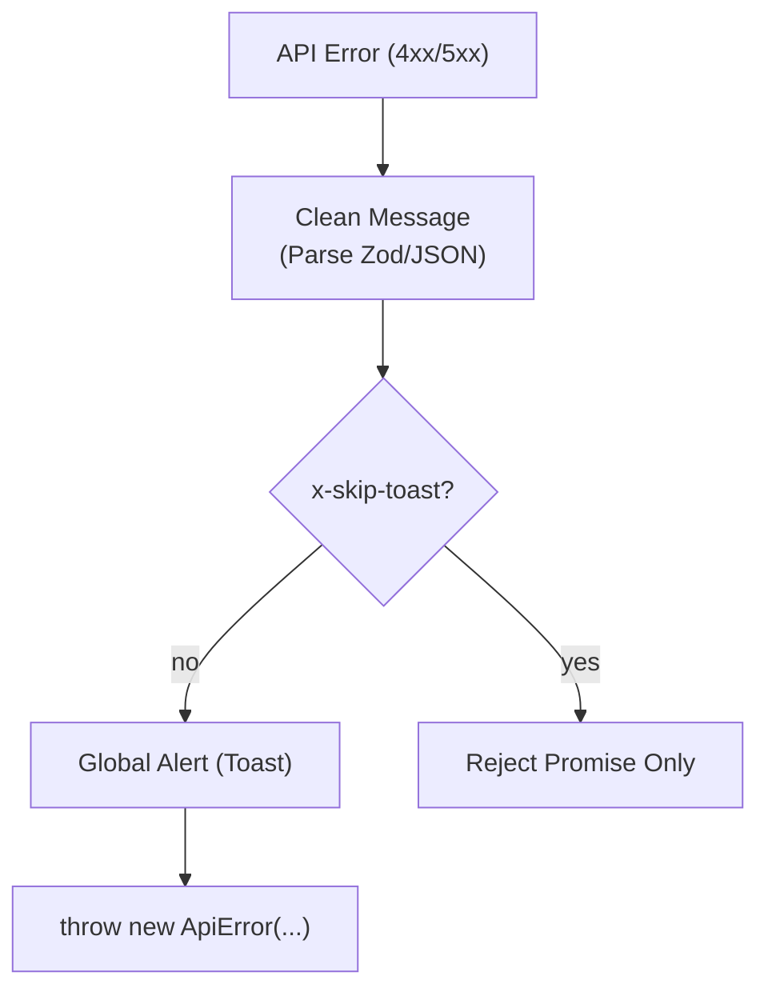
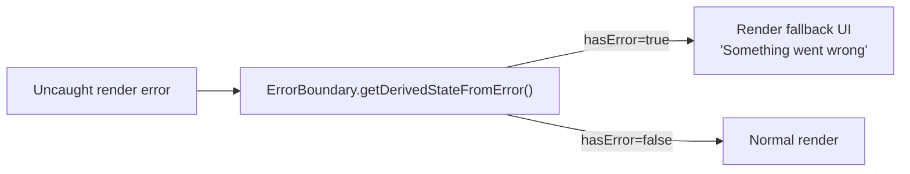

# Error Handling

## Error Categories

| Type                     | Class               | Origin                               | User-Visible?                  |
| ------------------------ | ------------------- | ------------------------------------ | ------------------------------ |
| **API errors** (4xx/5xx) | `ApiError`          | Response interceptor in `api.ts`     | Yes — `.message` from backend  |
| **Validation errors**    | Zod `ZodError`      | `lib/validators/*.ts` on form submit | Yes — field-level messages     |
| **Auth errors**          | `Error` (re-thrown) | `AuthContext` login/devLogin         | Yes — surfaced in Login UI     |
| **Unexpected crashes**   | Generic `Error`     | Runtime bugs                         | Yes — `ErrorBoundary` fallback |

---

## ApiError Class (`lib/errors/ApiError.ts`)

The frontend equivalent of the backend's `AppError`. Every non-2xx response from the backend is converted to an `ApiError` instance by the Axios response interceptor.

```typescript
class ApiError extends Error {
  statusCode: number; // HTTP status code
  isOperational: boolean; // true for 4xx (user error), false for 5xx (server bug)
}
```

**Consumer pattern:**

```typescript
try {
  await TourService.createTour(payload);
} catch (err) {
  if (err instanceof ApiError) {
    // .message is always human-readable (from backend's response envelope)
    setError(err.message);
  }
}
```

---

## Centralized API Error Transformation & Notification (`src/services/api.ts`)

The Axios **monitoring interceptor** runs on every request/response lifecycle. It performs automated error cleanup and global UI feedback.

### 4.1 Automatic Validation Formatting

The interceptor detects raw validation strings (commonly from Zod in the backend) and converts them into clean, user-friendly strings.

- **Before:** `Validation Failed: [{"message":"body.content is Content must be 10+ chars"}]`
- **After:** `Validation Failed: Content must be 10+ chars`

### 4.2 Global Notification System

Most non-GET errors (POST, PATCH, DELETE) are automatically broadcast to the global toast system.

1. The interceptor extracts the cleaned message.
2. It checks for the `x-skip-toast` header (in case a component handles the error locally).
3. It calls `useUIStore.addNotification({ type: 'error', message })`.



---

## Validation Errors (Zod)

Zod schemas in `lib/validators/` validate form data **before** any API call is made.

### Usage Pattern

```typescript
import { createTrekSchema } from "../lib/validators/tourValidators";

const result = createTrekSchema.safeParse(formData);
if (!result.success) {
  const fieldErrors = result.error.flatten().fieldErrors;
  // e.g. { name: ["Trek name must be at least 3 characters"] }
  setErrors(fieldErrors);
  return; // stop before calling the service
}
// Only call service when data is clean
await TourService.createTour(result.data);
```

Validation errors appear immediately in the UI on field blur or form submit — no network round-trip required.

---

## AuthContext Error Handling

Login errors are caught, converted to strings, and stored in `AuthContext.error`. The `Login.tsx` page reads this value and renders it inline.

```typescript
// AuthContext.login()
try {
  const { user, token } = await AuthService.loginWithGoogle(idToken);
  // ...
} catch (err: unknown) {
  const message = getErrorMessage(err, "Failed to login with Google");
  setError(message); // store for UI
  throw new Error(message); // re-throw so Login.tsx can respond
}
```

The internal `getErrorMessage()` helper handles three cases:

1. Axios-style error: `err.response.data.message`
2. Standard `Error`: `err.message`
3. Plain string: used as-is

---

## ErrorBoundary (`components/shared/ErrorBoundary.tsx`)

A React class-based Error Boundary wraps the entire application in `App.tsx`. It catches:

- Uncaught runtime JavaScript errors during rendering
- Errors thrown in lifecycle methods of child components



> **Note:** `ErrorBoundary` does **not** catch errors in async event handlers, `setTimeout`, or server calls. Those are handled by `try/catch` in services and hooks.

---

## Error Handling Checklist

When adding a new feature, ensure:

- [ ] Service method is wrapped in a try/catch in the calling hook or component
- [ ] User-facing error messages come from `err.message` (never expose raw stack traces)
- [ ] `instanceof ApiError` is used to distinguish API errors from programming bugs
- [ ] Form submission validates with Zod `.safeParse()` _before_ calling the service
- [ ] Loading states are set correctly (`setLoading(true/false)`) around async calls
