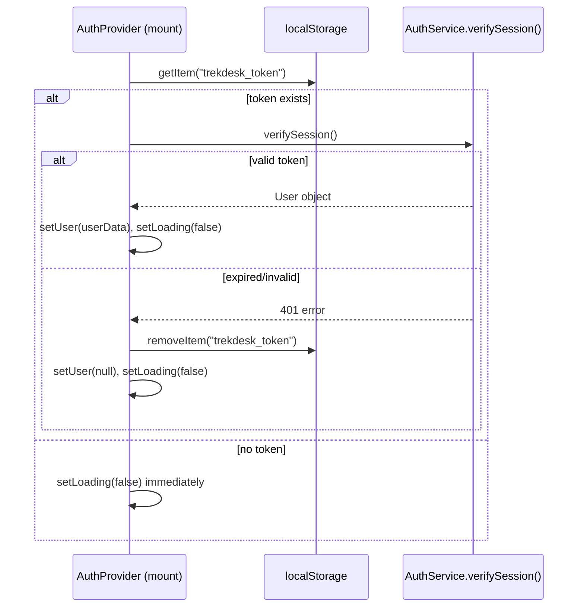

# State Management

The app uses a **two-tier state model**. This separation is intentional and important:

| State Kind                  | Tool           | Location                     | Example                            |
| --------------------------- | -------------- | ---------------------------- | ---------------------------------- |
| **Server state** (API data) | TanStack Query | `src/features/[f]/hooks/`    | Call logs, persona settings, tours |
| **Auth state**              | React Context  | `src/features/auth/context/` | Logged-in user, token lifecycle    |
| **Client/UI state**         | Zustand        | `src/store/uiStore.ts`       | Sidebar open/closed, theme         |

---

## TanStack Query (Server State)

All data that comes from the backend API is owned by TanStack Query. It handles:

- Caching and deduplication of requests
- Background refetching
- Loading and error states
- Optimistic updates (via `setQueryData`)
- Cache invalidation on mutations

### Query Client Configuration (`lib/queryClient.ts`)

| Setting                | Value       | Reason                                                       |
| ---------------------- | ----------- | ------------------------------------------------------------ |
| `refetchOnWindowFocus` | `false`     | Prevents jarring re-renders mid-workflow in a dashboard      |
| `retry`                | `1`         | Handles transient blips; prevents hammering a downed server  |
| `staleTime`            | `5 minutes` | Dashboard data doesn't need to be live — reduces API traffic |

### Query Key Conventions

| Domain           | Query Key                        | Scope           |
| ---------------- | -------------------------------- | --------------- |
| Analytics stats  | `["analytics", "stats"]`         | All stats       |
| Call logs        | `["analytics", "logs"]`          | All logs        |
| Single log       | `["analytics", "logs", id]`      | Per ID          |
| Persona settings | `["persona", "settings"]`        | Singleton       |
| Knowledge search | `["knowledge", "search", query]` | Per search term |
| All tours        | `["tours"]`                      | All tours       |
| Single tour      | `["tours", id]`                  | Per ID          |

### Hook → Service → API Flow

```mermaid
flowchart LR
    Page["Page Component"]
    Hook["useXxx() hook\n(features/[f]/hooks/)"]
    Cache["TanStack Query Cache"]
    Service["XxxService\n(features/[f]/services/)"]
    API["api.ts (src/services/Axios)\n+ interceptors"]
    Backend["Backend REST API"]

    Page -->|"calls"| Hook
    Hook -->|"queryFn / mutationFn"| Cache
    Cache -->|"on miss"| Service
    Service -->|"HTTP call"| API
    API -->|"requests"| Backend
    Backend -->|"response"| API
    API -->|"typed data"| Service
    Service -->|"resolved data"| Cache
    Cache -->|"{ data, isLoading, error }"| Hook
    Hook -->|"renders"| Page
```



---

## AuthContext (Auth State)

Authentication state is managed outside TanStack Query because it is _not_ typical server state — it is a session that the app controls directly (login, logout, token storage).

### State Shape

```typescript
interface AuthContextType {
  user: User | null; // null = not logged in
  loading: boolean; // true during initial session check on mount
  error: string | null; // login error message
  login: (idToken: string) => Promise<void>;
  devLogin: (secret: string) => Promise<void>;
  logout: () => void;
}
```

### Session Initialization



The `loading: true` initial state is critical — it prevents `ProtectedRoute` from flashing the login redirect while the session check is still in-flight.

---

## Zustand (UI State)

`uiStore` holds **only** ephemeral presentation state — nothing domain-related, nothing that needs to persist across sessions.

### Store Shape

```typescript
interface UIState {
  isSidebarOpen: boolean; // defaults to true
  theme: "light" | "dark"; // defaults to "dark"
  toggleSidebar: () => void;
  setTheme: (theme: "light" | "dark") => void;
}
```

### Usage Pattern

```tsx
// Any component — no Provider needed
import { useUIStore } from "../store/uiStore";

const { isSidebarOpen, toggleSidebar } = useUIStore();
```

Zustand does not require a Context Provider; the store is a module singleton, making it extremely simple to consume anywhere in the tree.
