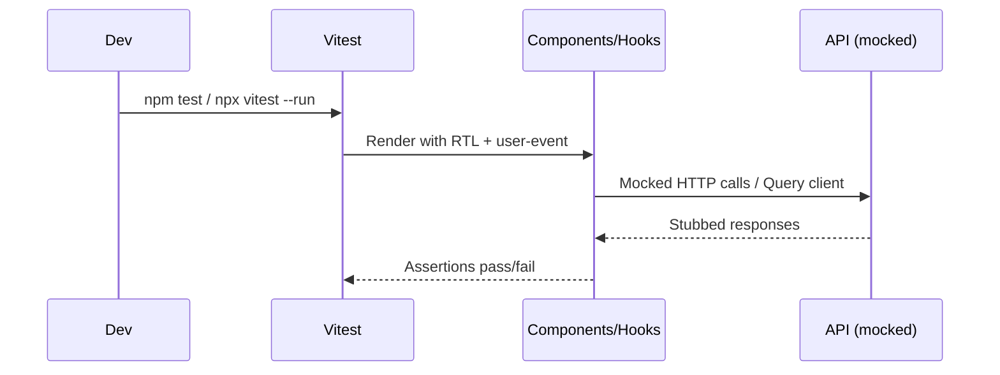

# Testing

## Flow



## Test Stack

| Tool                            | Role                                                       |
| ------------------------------- | ---------------------------------------------------------- |
| **Vitest**                      | Test runner (Vite-native, Jest-compatible API)             |
| **@testing-library/react**      | Renders components and queries the DOM                     |
| **@testing-library/user-event** | Simulates real user interactions (typing, clicking)        |
| **@testing-library/jest-dom**   | Custom matchers (`toBeInTheDocument`, `toHaveValue`, etc.) |
| **jsdom**                       | Simulated browser DOM (configured in `vite.config.ts`)     |

---

## Running Tests

```bash
# Watch mode — runs affected tests on file change
npm test

# Single-pass — runs all tests once (CI / pre-commit)
npx vitest --run

# Run a specific file
npx vitest --run src/components/ui/Button.test.tsx

# Run tests matching a pattern
npx vitest --run -t "renders with primary variant"
```

---

## Test File Conventions

- Tests live **next to the source file** they cover.
- Naming: `[ComponentName].test.tsx` for React, `[module].test.ts` for utilities.
- Use `describe` + `it` (no bare `test()`).

```
src/
  components/ui/
    Button.tsx
    Button.test.tsx
  lib/errors/
    ApiError.ts
    ApiError.test.ts
  lib/validators/
    validators.test.ts
  store/
    uiStore.ts
    uiStore.test.ts
```

---

## Coverage Areas (global)

### UI Components (`src/components/ui/*.test.tsx`)

| Component | What's Tested                                                                          |
| --------- | -------------------------------------------------------------------------------------- |
| `Button`  | Default rendering, all variants, size classes, `isLoading` state, disabled state       |
| `Input`   | Label rendering, error state styling and message, helperText display                   |
| `Card`    | Default and glass variants, `hoverable` prop, all sub-components (Header, Title, etc.) |
| `Badge`   | All 6 variants, default variant fallback                                               |

### Zustand Store (`src/store/uiStore.test.ts`)

| Feature         | What's Tested                            |
| --------------- | ---------------------------------------- |
| Initial state   | `isSidebarOpen: true`, `theme: "dark"`   |
| `toggleSidebar` | Toggles from open ↔ closed               |
| `setTheme`      | Sets theme to "light" and back to "dark" |
| Store isolation | Each test gets a fresh store state       |

### ApiError (`src/lib/errors/ApiError.test.ts`)

| Feature         | What's Tested                                          |
| --------------- | ------------------------------------------------------ |
| Constructor     | `statusCode` and `message` are set                     |
| `isOperational` | True for 400–499, false for 500+                       |
| Error identity  | `instanceof ApiError` and `instanceof Error` both true |
| `name` property | Always `"ApiError"`                                    |
| Prototype chain | Required for TypeScript class extending Error          |

### Validators (`src/lib/validators/validators.test.ts`)

| Schema                  | What's Tested                                                    |
| ----------------------- | ---------------------------------------------------------------- |
| `ingestKnowledgeSchema` | Valid input, min/max content, UUID trek_id, metadata shape       |
| `knowledgeSearchSchema` | Min 3 chars, max 500 chars, empty string rejection               |
| `updatePersonaSchema`   | Temperature boundaries (0–2), empty voice_name, long instruction |
| `createTrekSchema`      | Valid trek, name min, price positive, difficulty enum values     |
| `updateTrekSchema`      | All fields optional (partial), combined partial update           |

---

## Writing a New Test

```tsx
import { render, screen } from "@testing-library/react";
import userEvent from "@testing-library/user-event";
import { MyComponent } from "./MyComponent";

describe("MyComponent", () => {
  it("renders with default props", () => {
    render(<MyComponent />);
    expect(screen.getByRole("button")).toBeInTheDocument();
  });

  it("calls onClick when clicked", async () => {
    const user = userEvent.setup();
    const handleClick = vi.fn();
    render(<MyComponent onClick={handleClick} />);

    await user.click(screen.getByRole("button"));
    expect(handleClick).toHaveBeenCalledOnce();
  });
});
```

---

## Testing Hooks with TanStack Query

Hooks that use `useQuery` or `useMutation` require a `QueryClientProvider` wrapper:

```tsx
import { QueryClient, QueryClientProvider } from "@tanstack/react-query";
import { renderHook } from "@testing-library/react";
import { usePersonaSettings } from "../hooks/usePersona";

const createWrapper = () => {
  const queryClient = new QueryClient({
    defaultOptions: { queries: { retry: false } },
  });
  return ({ children }: { children: React.ReactNode }) => (
    <QueryClientProvider client={queryClient}>{children}</QueryClientProvider>
  );
};

it("returns loading state initially", () => {
  const { result } = renderHook(() => usePersonaSettings(), {
    wrapper: createWrapper(),
  });
  expect(result.current.isLoading).toBe(true);
});
```

---

## Feature-Level Coverage (see feature docs)

- Auth: token exchange/verify flows, ProtectedRoute gating (`features/FEATURE_AUTH.md`).
- Persona: temperature bounds, preview bridge, optimistic updates (`features/FEATURE_PERSONA.md`).
- Knowledge: ingest/search validators, search caching by query (`features/FEATURE_KNOWLEDGE.md`).
- Tours: create/update/delete, pricing tiers, cache invalidation (`features/FEATURE_TOURS.md`).
- Widget: settings save, embed snippet generation, origin validation (`features/FEATURE_WIDGET.md`).
- Conversations: list/detail fetch enabled flags, legacy transcript rendering (`features/FEATURE_CONVERSATIONS.md`).
- Diagnostics: prompt submit + trace rendering (`features/FEATURE_DIAGNOSTICS.md`).

---

## CI Integration

```bash
npx vitest --run
```

Exits `0` on all-pass, non-zero on any failure.
