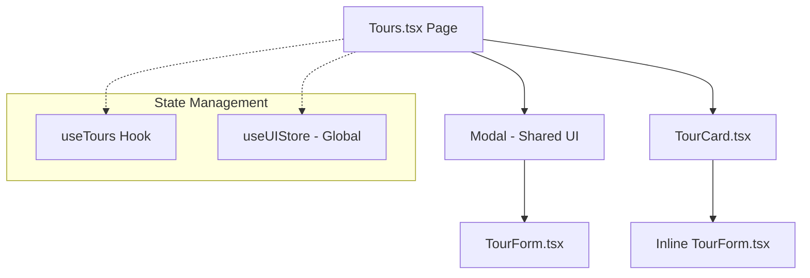
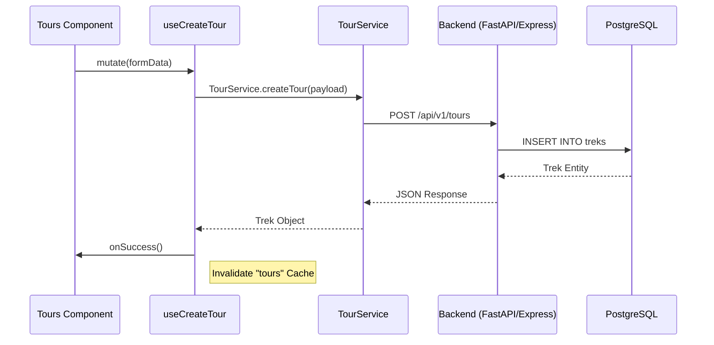

# Tour Management Feature

## Overview

The **Tour Management** module is a core part of the TrekDesk AI platform, allowing administrators to manage their catalog of trekking itineraries. These tours serve as the primary knowledge source for the AI Assistant, which uses this data to answer customer queries about pricing, difficulty, and itinerary details.

## Component Architecture

The frontend is built using a modular, hook-driven architecture to ensure separate concerns and high performance.

### Component Hierarchy

- **Tours.tsx**: The parent orchestrator. Manages the main grid and the "Create" modal state.
- **TourCard.tsx**: High-fidelity presentation of a trek. Handles its own local "Editing" state to allow inline updates.
- **TourForm.tsx**: A unified, complex form used for both creating and updating treks. Manages dynamic pricing tiers.
- **Modal.tsx**: A reusable overlay component for a focused creation experience.

## Data Flow & Lifecycle

Tours uses **TanStack Query (React Query)** for server state management, providing automatic caching and background refetching.

### CRUD Sequence

## Pricing Tier System

The feature supports **Dynamic Pax-Based Pricing**, allowing operators to define different price ranges based on the number of participants.

- **Pax Range**: A descriptive string (e.g., "1", "2-3", "4+").
- **Min/Max Price**: The price range per person for that specific group size.

### Database Alignment

The frontend types are strictly aligned with the backend `treks` table to prevent transformation errors:
| Frontend Field | Backend Column | Type | Description |
| :--- | :--- | :--- | :--- |
| `base_price_per_person` | `base_price_per_person` | Numeric | Default starting price |
| `difficulty_level` | `difficulty_level` | Enum | easy, moderate, challenging, extreme |
| `pricing_tiers` | `pricing_tiers` | JSONB | Array of pax/price objects |

## Global UI Integration

The Tour feature is integrated with the **Global Notification System** (`uiStore`):

1.  **Toasts**: Every successful action (Create/Update/Delete) triggers a non-blocking floating notification.
2.  **Confirmation Modal**: Destructive actions like "Delete" trigger a branded modal instead of a browser native popup, ensuring a premium feel.
3.  **Loading States**: Component-level loaders (Spinners) and global route loaders are used to provide immediate feedback during network latency.
