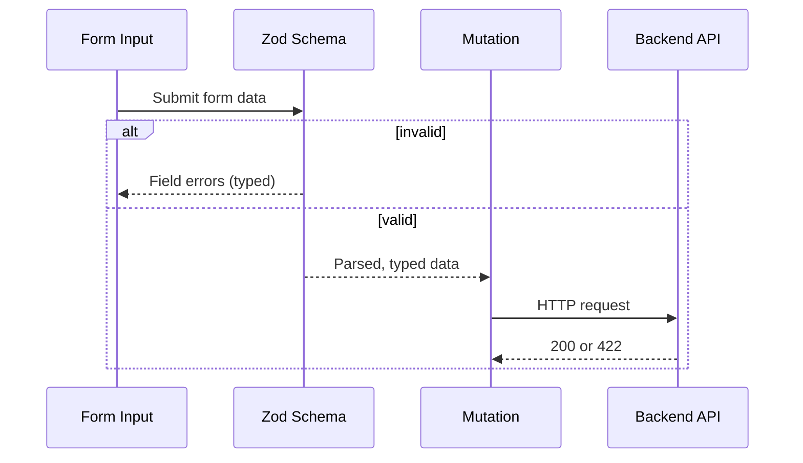

# Validation

All client-side validation uses **Zod v4**. Schemas live in `src/lib/validators/` and mirror backend validators to keep constraints and messages consistent.

## Flow (UI → Zod → API)



## Why Mirror the Backend?

- Errors appear instantly while typing (no network round-trip).
- Invalid requests are blocked before hitting the API (saves embedding/DB cost).
- Error messages stay identical to backend responses—no UX drift.

## Where to Find Validators

- Knowledge: `features/FEATURE_KNOWLEDGE.md`
- Persona: `features/FEATURE_PERSONA.md`
- Tours: `features/FEATURE_TOURS.md`
- Widget: `features/FEATURE_WIDGET.md` (shared persona rules)
- Auth: `features/FEATURE_AUTH.md` (login/verify shapes)

## Schema Catalogue (summary)

### `knowledgeValidators.ts`

#### `ingestKnowledgeSchema`

Used by: `KnowledgeBase.tsx` — ingest form submission

| Field      | Type                     | Rules                        | Error Message                                                    |
| ---------- | ------------------------ | ---------------------------- | ---------------------------------------------------------------- |
| `content`  | `string`                 | required, min 10, max 50,000 | "Content must be at least 10 characters" / "Content is too long" |
| `trek_id`  | `string (UUID) \| null`  | optional, UUID format        | "Must be a valid Trek ID (UUID format)"                          |
| `metadata` | `Record<string, string>` | optional                     | —                                                                |

Mirrors: `KnowledgeDocumentSchema` in `knowledge.schema.ts` (backend)

#### `knowledgeSearchSchema`

Used by: `KnowledgeBase.tsx` — search bar

| Field | Type     | Rules                    | Error Message                                |
| ----- | -------- | ------------------------ | -------------------------------------------- |
| `q`   | `string` | required, min 3, max 500 | "Search query must be at least 3 characters" |

---

### `personaValidators.ts`

#### `updatePersonaSchema`

Used by: `Persona.tsx` — settings save form

| Field                | Type     | Rules                    | Error Message                                                    |
| -------------------- | -------- | ------------------------ | ---------------------------------------------------------------- |
| `voice_name`         | `string` | required, min 1, max 100 | "Voice name cannot be empty"                                     |
| `system_instruction` | `string` | required, max 10,000     | "System instruction is too long"                                 |
| `temperature`        | `number` | min 0, max 2             | "Temperature must be at least 0" / "Temperature cannot exceed 2" |

> Important: `temperature` max is **2**, not 1. Gemini models support 0–2. Confusing this with the GPT convention (0–1) will cause backend 422 errors.

Mirrors: `UpdateAISettingsPayloadSchema` in `ai.schema.ts` (backend)

---

### `tourValidators.ts`

#### `createTrekSchema`

Used by: `WidgetConfig.tsx` / Tour creation forms

| Field                   | Type                                           | Rules                             | Error Message                             |
| ----------------------- | ---------------------------------------------- | --------------------------------- | ----------------------------------------- |
| `name`                  | `string`                                       | required, min 3, max 255          | "Trek name must be at least 3 characters" |
| `description`           | `string`                                       | optional                          | —                                         |
| `base_price_per_person` | `number`                                       | required, positive                | "Price must be greater than 0"            |
| `transport_fee`         | `number`                                       | optional, non-negative, default 0 | "Transport fee cannot be negative"        |
| `difficulty_level`      | `"easy"\|"moderate"\|"challenging"\|"extreme"` | optional enum                     | —                                         |

#### `updateTrekSchema`

`createTrekSchema.partial()` — all fields optional. Used for PATCH requests.

Mirrors: `TrekSchema` + `CreateTrekPayloadSchema` in `trek.schema.ts` (backend)

---

## Usage Patterns

### Pattern A: Manual `safeParse` (current)

```typescript
import { ingestKnowledgeSchema } from "../lib/validators/knowledgeValidators";

const handleSubmit = (formData: unknown) => {
  const result = ingestKnowledgeSchema.safeParse(formData);
  if (!result.success) {
    const errors = result.error.flatten().fieldErrors;
    setErrors(errors);
    return;
  }
  ingestKnowledge.mutate(result.data);
};
```

### Pattern B: With `react-hook-form` (recommended)

```typescript
import { zodResolver } from "@hookform/resolvers/zod";
import {
  createTrekSchema,
  type CreateTrekFormValues,
} from "../lib/validators/tourValidators";

const {
  register,
  handleSubmit,
  formState: { errors },
} = useForm<CreateTrekFormValues>({
  resolver: zodResolver(createTrekSchema),
});
```

---

## Adding a New Validator

1. Create `src/lib/validators/myFeatureValidators.ts`.
2. Import `{ z } from "zod"` and define your schema.
3. Export the schema and an inferred type via `z.infer<typeof mySchema>`.
4. Cross-check every field constraint against the corresponding backend schema.

```typescript
import { z } from "zod";

export const myFeatureSchema = z.object({
  name: z.string().min(1, "Name is required"),
});

export type MyFeatureFormValues = z.infer<typeof myFeatureSchema>;
```
