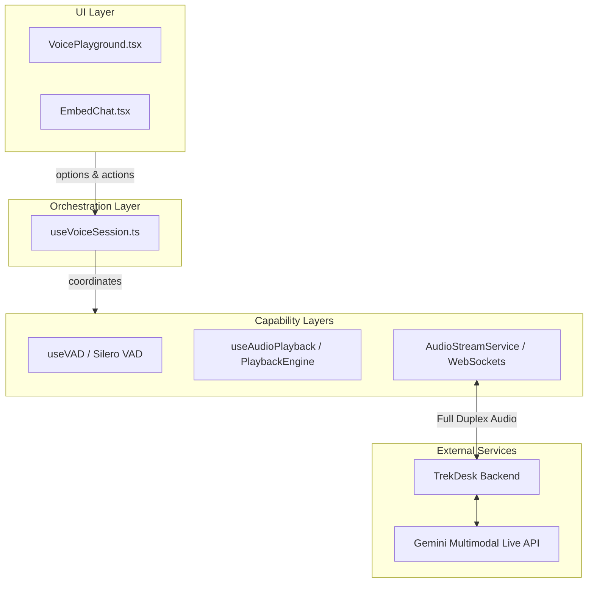
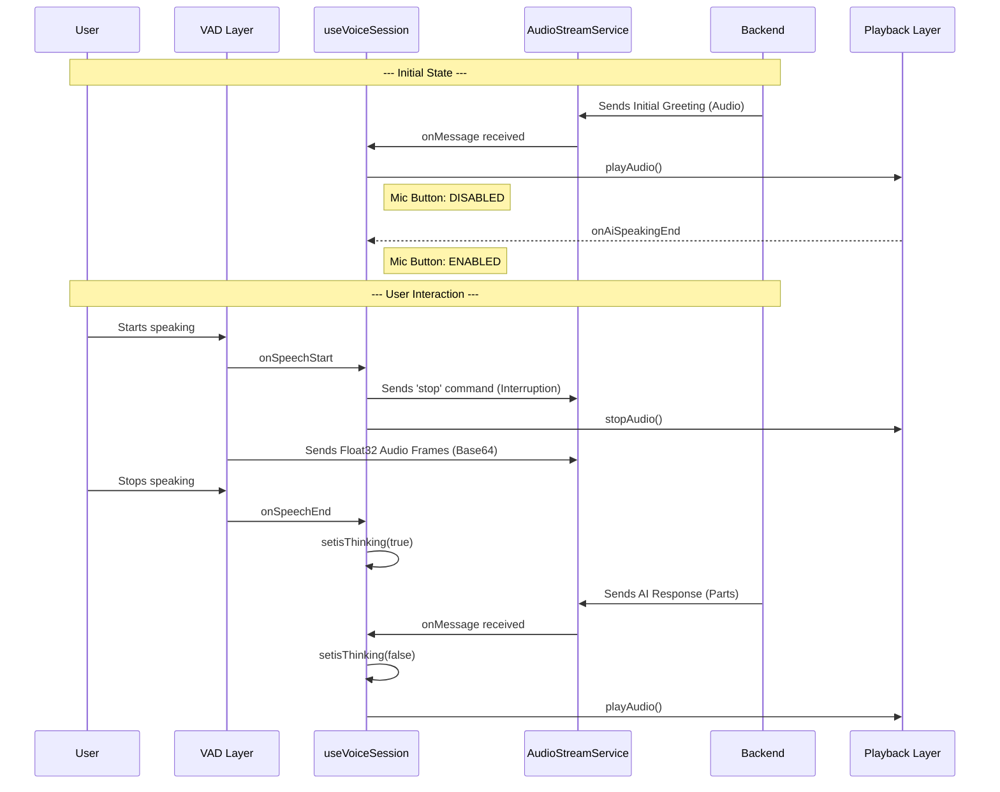

# Voice Feature Architecture (Frontend)

This document provides a comprehensive overview of the TrekDesk AI voice interaction system. Our design prioritizes low-latency multimodal interaction, robust state management, and clear user feedback.

## 1. Layered Architecture

We follow a strictly decoupled, layered approach where UI components do not handle hardware or protocol logic directly.

---

## 2. The Orchestrator (`useVoiceSession.ts`)

The `useVoiceSession` hook is the "brain" of the voice feature. It manages the complex state machine required for natural conversation.

### Primary Responsibilities:

- **Lifecycle Management**: Initializing and destroying VAD and WebSocket connections.
- **Initial Greeting Lock**: Ensuring the user cannot interrupt the AI until the _first_ greeting is delivered.
- **Interruption Support**: Allowing the user to speak over the AI _after_ the initial greeting (with a 400ms safety buffer).
- **Thinking Logic**: Managing the `isThinking` state based on VAD activity and server responses.

---

## 3. Core Interaction Flow

The system uses a full-duplex WebSocket stream. Audio is sent as Float32 frames converted to Base64, and received as audio buffer chunks.

---

## 4. Interaction States & UI Feedback

To ensure "Playground Parity", the widget and playground use a unified visual language.

| State           | Status Label              | Mic Icon | Mic Color         | Mic Enabled |
| :-------------- | :------------------------ | :------- | :---------------- | :---------- |
| **Connecting**  | "Waiting for greeting..." | `Mic`    | Gray/Opacity      | No          |
| **Greeting**    | "Trek AI Speaking..."     | `Mic`    | Gray/Opacity      | No          |
| **Idle**        | "Tap to Speak"            | `Mic`    | Brand Color       | Yes         |
| **Recording**   | "I'm Listening..."        | `MicOff` | **Red (#ef4444)** | Yes         |
| **Thinking**    | "Thinking..."             | `Mic`    | Brand Color       | Yes         |
| **AI Speaking** | "Trek AI Speaking..."     | `Mic`    | Brand Color       | Yes         |

---

## 5. Key Implementation Details

### Greeting Detection (`useVoiceSession.ts`)

We use a combination of a state variable `hasFinishedInitialGreeting` and a ref `aiGreetingStartedRef`. The lock is released only when the system detects that AI speech has _started_ and then _ended_ for the first time.

### Interruption Buffer

To prevent accidental triggers from background noise or microphone pops, we implement a **400ms safety window**. The system will only stop current AI playback if the user speech starts after the AI has been speaking for at least 400ms.

### VAD Configuration

We use the **Silero VAD v5** model with the following robustness tuning:

- `positiveSpeechThreshold`: 0.45
- `minSpeechFrames`: 3 (filtering out clicks)
- `redemptionFrames`: 8 (allowing natural pauses between words)
