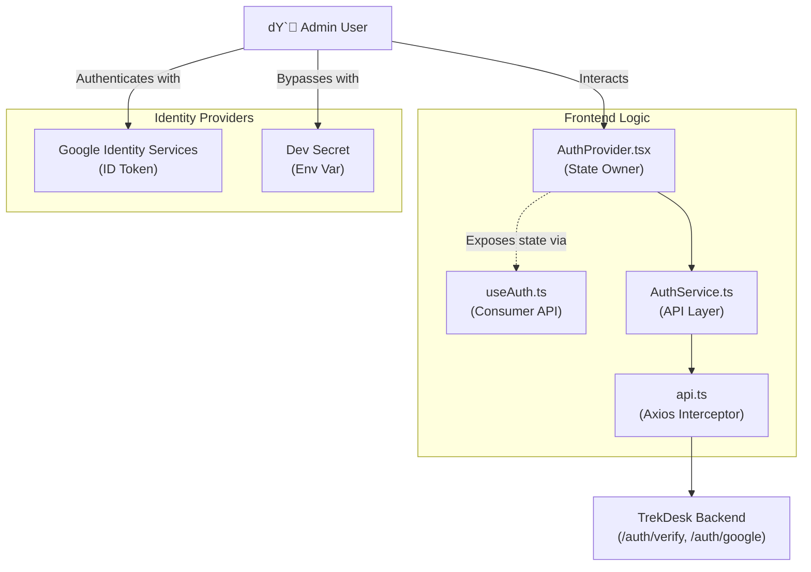
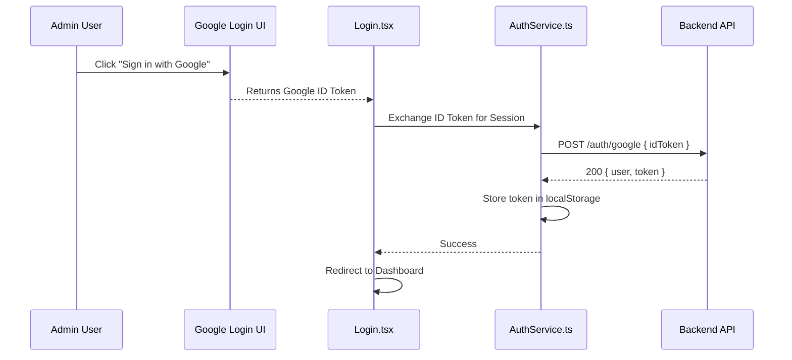
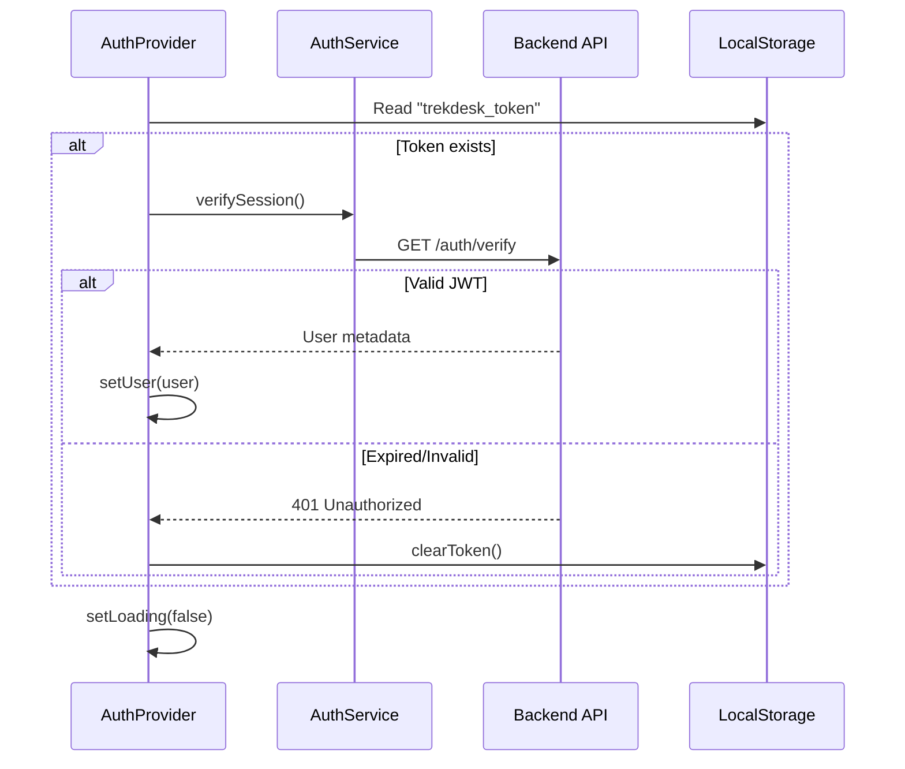

# Authentication Feature

## Overview

Authentication uses **Google OAuth 2.0** plus a **Dev Secret** bypass for local testing. Implemented as a vertical feature in `src/features/auth` with centralized token handling and route protection.

## Flows

### Architecture

### Google OAuth Authentication

### Session Initialization

## Data Contracts

- Endpoints: `POST /auth/google`, `POST /auth/dev`, `GET /auth/verify`.
- Types: `user`, `token`, and error payloads aligned with backend schemas.
- Token storage: `localStorage["trekdesk_token"]`; Axios interceptor attaches Bearer.
- Headers: `x-skip-toast` to suppress global toasts on login/verify failures.

## State Ownership

- Context: `AuthProvider` holds `user`, `loading`, `error`, and actions (`login`, `devLogin`, `logout`).
- Server state: session verification handled via AuthService calls (not cached in Query).
- UI state: `ProtectedRoute` gates routes; loading gate prevents redirect flicker.

## UI Composition

- **Login.tsx**: Google button + dev secret input (behind flag).
- **ProtectedRoute.tsx**: guards authed routes and preserves redirect intent.
- **AuthProvider.tsx**: wraps router; initializes session on mount.

## Edge Cases & Constraints

- Token expiry: 401 clears token and redirects to `/login?expired=true`.
- Dev secret guarded by env flag; omit in production builds.
- Ensure loading gate remains until verify completes to avoid flash of unauth content.

## Testing Notes

- Google flow: mock token exchange success/failure; localStorage set/clear.
- Session init: token present vs missing vs expired; redirects after logout.
- ProtectedRoute: ensures unauth users redirected with `from` saved.
- Dev login: enabled only when flag set; rejects invalid secret.
