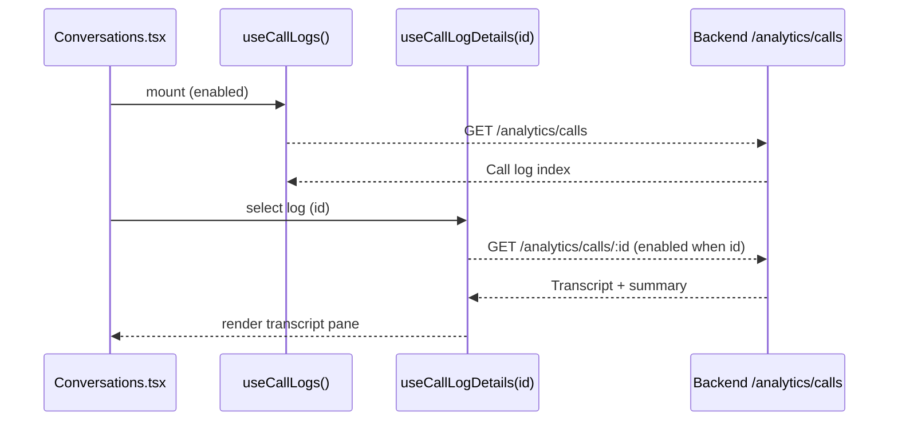

# Conversations Feature

## Overview

Primary interface for admins to review, analyze, and manage customer interactions. Split-pane layout shows session list and detailed transcript with summaries and insights.

## Flows

### Call Log Fetch & Detail Load

## Data Contracts

- Endpoints: `GET /analytics/calls`, `GET /analytics/calls/:id`, `DELETE /analytics/calls/:id`.
- Types: call log summary (id, sentiment, duration, timestamp); detail includes transcript (array or legacy object) and AI summary.
- Query keys: `["analytics", "logs"]` (index), `["analytics", "logs", id]` (detail).
- Deletion: mutation invalidates both index and the specific detail cache entry.

## State Ownership

- Server data: TanStack Query hooks `useCallLogs`, `useCallLogDetails`, `useDeleteCallLog`.
- UI state: selected conversation id, sidebar scroll position, confirmation modal for delete.
- Auth: gated via `ProtectedRoute`; Axios interceptor attaches token.

## UI Composition

- **Split Pane Layout**: left list of sessions, right detail pane.
- **Conversations.tsx**: container managing selection and wiring hooks.
- **Detail pane**: transcript renderer supports structured array and legacy `full_text`.
- Styling via `Conversations.module.css` for bubble animations.

## Edge Cases & Constraints

- Transcript normalization: support both structured array and legacy object format.
- Sentiment badges: highlight hot leads (`sentiment_score > 0.7`) vs standard inquiries.
- Delete safety: always confirm before removal; update selection after delete.

## Testing Notes

- List fetch renders items; detail fetch gated by `enabled` flag until selection.
- Legacy transcript renders without crash; structured transcripts render roles.
- Delete mutation clears detail pane, invalidates list, and shows toast.
- Loading/error states: spinners per pane; error banners without double toasts.
