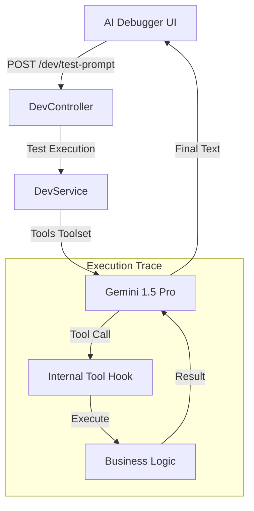

# AI Diagnostic & Debugging Feature

## Overview

Execution Sandbox for testing prompts and tool-calling logic without running full voice sessions. Captures full internal trace for debugging Gemini tool usage.

## Flows

### Logic Trace Flow

## Data Contracts

- Endpoint: `POST /dev/test-prompt` (executes prompt and returns trace).
- Payload: prompt string, optional tool selection overrides.
- Response: final text plus ordered tool call/response trace.
- Permissions: protected to admin users; may be further guarded by env flag.

## State Ownership

- Server data: fetch-on-submit (no background caching); store latest trace in component state.
- UI state: prompt input, selected tool filters, trace viewer state.
- Auth: standard AuthProvider + ProtectedRoute enforcement.

## UI Composition

- **AIDebugger.tsx**: page; handles submit and renders trace.
- **Trace timeline**: shows tool calls and raw responses.
- **Guide availability preview**: optional calendar check for booking logic.
- **Tools registry**: list of exposed tools with JSON schemas.

## Edge Cases & Constraints

- Respect rate limits; avoid spamming API with rapid submits.
- Tool schema inspection should handle missing/invalid schema gracefully.
- Availability preview depends on Google Calendar sync; show status when unavailable.

## Testing Notes

- Prompt submit success/failure; displays final text and trace.
- Tool registry renders schemas and required fields.
- Calendar preview handles empty/busy states.
- Error handling: network failures show toast + preserve user input.
