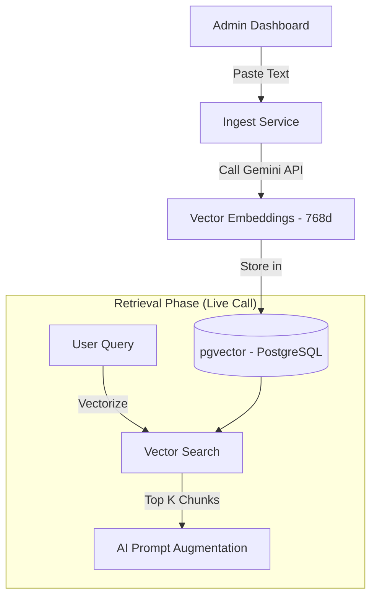
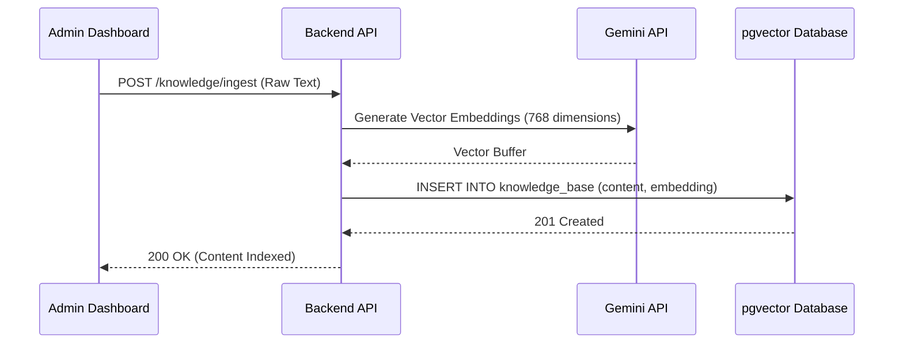
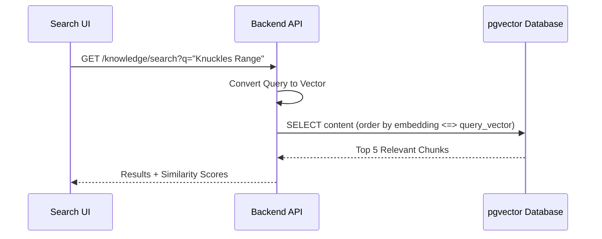

# Knowledge Base & RAG Feature

## Overview

Provides ingestion, management, and semantic search over trekking content using a RAG pipeline (Gemini embeddings + pgvector). Powers the AI assistant with domain context.

## Flows

### High-Level Architecture

### Content Ingestion Flow

### Semantic Retrieval Flow

## Data Contracts

- Endpoints: `POST /knowledge/ingest`, `GET /knowledge/search`, `PUT /knowledge/:id`, `DELETE /knowledge/:id`.
- Types: chunks with `id`, `content`, `embedding`, `metadata`; search returns results with similarity.
- Validators: `ingestKnowledgeSchema`, `knowledgeSearchSchema` (see `VALIDATION.md`).
- Query keys: `["knowledge"]` (list), `["knowledge", "search", query]` (search results).
- Embeddings: Gemini text embeddings (768 dimensions), stored in `pgvector`.

## State Ownership

- Server data: TanStack Query hooks in `features/knowledge/hooks` for list/search/mutations.
- UI state: local form state for ingestion + search inputs; modal state for edit/delete confirmations.
- Auth: gated via `ProtectedRoute`.

## UI Composition

- **IngestSection**: paste/upload content, submits to ingest endpoint.
- **KnowledgeManager**: list + inline edit/delete; re-embeds on edit.
- **SemanticSearch**: test retrieval with query and similarity scores.

## Edge Cases & Constraints

- Large text is chunked before embedding; enforce min/max length per validator.
- UUID validation for optional `trek_id`; metadata must be key/value strings.
- Avoid redundant documents to keep retrieval precise; delete stale versions.

## Testing Notes

- Ingestion: valid/invalid payloads, UUID checks, max length handling.
- Search: minimum query length, pagination/top-K handling, cache keys per query.
- Edit/delete: optimistic updates vs invalidation; ensure embeddings refresh on edit.
- Error surfaces: backend failures show toast + inline errors without double submission.
