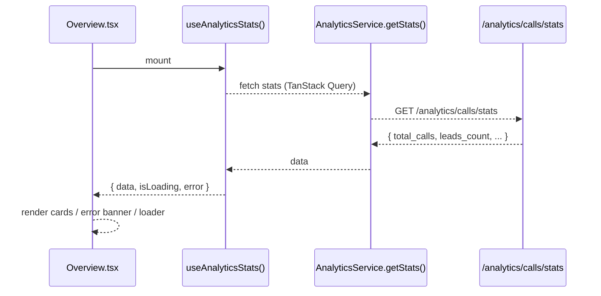
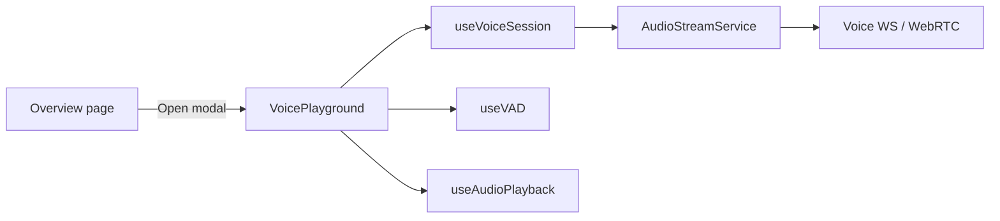

# Overview Dashboard Feature

## Overview

Landing page for admins after login. Surfaces KPI stats and provides a launcher into the Voice Playground for real-time assistant testing.

## Flows

### KPI Fetch & Render

### Voice Playground Launcher

## Data Contracts

- Endpoint: `GET /analytics/calls/stats` (via `AnalyticsService.getStats`).
- Type: `CallStats` (total_calls, avg_duration_seconds, avg_sentiment_score, calls_today, calls_this_week, leads_count if present).
- Query key: `["analytics", "stats"]` in `useAnalyticsStats`.
- Voice Playground: uses voice feature hooks/services (see `FEATURE_VOICE.md`).

## State Ownership

- Server state: TanStack Query for stats (loading/error handled inline).
- UI state: `isPlaygroundOpen` local state toggles Voice Playground modal.
- Auth: protected route (handled at router level).

## UI Composition

- **Overview.tsx**: page container; renders KPI grid and Voice Playground card.
- **VoicePlayground**: modal component imported from `features/voice/components/VoicePlayground`.
- **UI primitives**: `Card`, `CardHeader`, `CardTitle`, `CardContent`, `Button`.

## Edge Cases & Constraints

- Loading state: show spinner when stats are still fetching and no data yet.
- Error state: banner with backend error message if stats fetch fails.
- Stats defaults: fall back to `"0"` when data missing to avoid undefined UI.

## Testing Notes

- Stats hook: handles loading, error, and success renders.
- Voice Playground button: opens modal and renders playground content.
- Error banner: displays when `error` is set from `useAnalyticsStats`.
