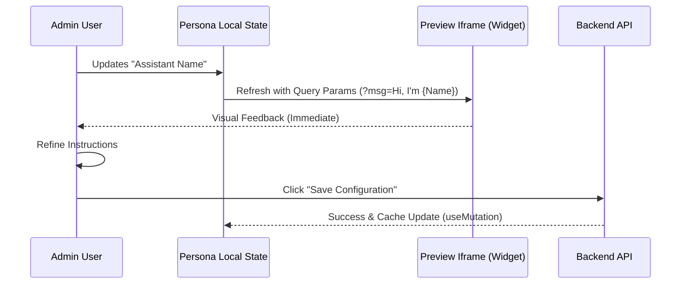

# AI Persona Feature

## Overview

Configures the AI assistant’s identity, tone, and constraints. Provides a live preview bridge so admins can see changes before saving.

## Flows

### Real-time Preview Sequence

## Data Contracts

- Endpoints: `GET /persona/settings`, `PUT /persona/settings`.
- Types: `voice_name`, `system_instruction`, `temperature`.
- Validators: `updatePersonaSchema` (see `VALIDATION.md`), temperature range `0–2`.
- Query keys: `["persona", "settings"]`.
- Mutations: optimistic cache update via `queryClient.setQueryData`.

## State Ownership

- Server data: TanStack Query hooks `usePersonaSettings` and `useUpdatePersonaSettings`.
- UI state: local form state + modal state for `VoicePlayground`.
- Auth: protected route; depends on GoogleOAuthProvider and AuthProvider.

## UI Composition

- **Persona.tsx**: page container; manages grid layout and preview injection.
- **VoicePlayground.tsx**: modal for selecting/testing voices.
- UI primitives: `Card`, `Badge`, `Button` for consistent layout.
- Preview iframe: loads widget with query params for live visual feedback.

## Edge Cases & Constraints

- Temperature must respect max `2` (Gemini range) to avoid backend 422s.
- Preview should not persist unsaved changes; ensure local-only until save.
- Instruction length capped (see validator); guard against empty voice name.
- Keep cache in sync after save to avoid stale preview data.

## Testing Notes

- Form validation: temperature boundaries, empty voice name, long instructions.
- Preview bridge: iframe updates on local state changes without hitting API.
- Mutation: optimistic cache update and toast behavior on success/failure.
- Voice modal: open/close, selection persists to form, resets on cancel.
