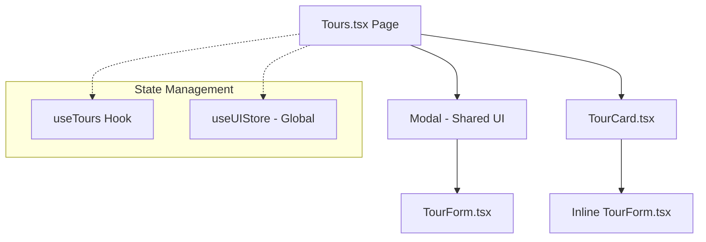
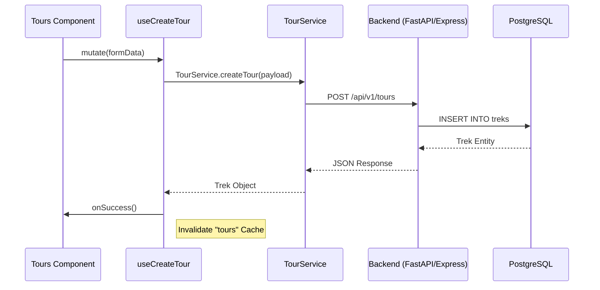

# Tour Management Feature

## Overview

The **Tour Management** module lets administrators manage trekking itineraries that power the AI assistant (pricing, difficulty, itinerary details). Built as a modular, hook-driven feature with TanStack Query for server state.

## Flows

### Component Hierarchy

### CRUD Sequence

## Data Contracts

- Endpoints: `GET /tours`, `POST /api/v1/tours`, `PATCH /api/v1/tours/:id`, `DELETE /api/v1/tours/:id`.
- Types: mirrors backend `treks` table (`base_price_per_person`, `difficulty_level`, `pricing_tiers`).
- Validators: `createTrekSchema`, `updateTrekSchema` (see `VALIDATION.md`).
- Query keys: `["tours"]` (list), `["tours", id]` (detail).
- Mutation side effects: invalidate `["tours"]` and `["tours", id]` when updating/deleting.

## State Ownership

- Server data: TanStack Query (`useTours`, `useCreateTour`, `useUpdateTour`, `useDeleteTour`).
- UI state: `useUIStore` for toasts, modals, and loading overlays.
- Form state: local component state inside `TourForm` for tier rows and inline editing.

## UI Composition

- **Tours.tsx**: Page orchestrator; owns modal open state and grid layout.
- **TourCard.tsx**: Presentational card with inline edit mode.
- **TourForm.tsx**: Shared form for create/update; handles dynamic pricing tiers.
- **Modal.tsx**: Reusable overlay for focused creation/editing flow.

## Edge Cases & Constraints

- Pricing tiers must keep non-negative prices; pax ranges should be unique per trek.
- `difficulty_level` enum: `easy | moderate | challenging | extreme`.
- Validation: name min 3 chars; price > 0; transport fee >= 0.
- Keep toast + confirmation modal integration for destructive actions.

## Testing Notes

- Create/update/delete happy paths trigger cache invalidation and toasts.
- Inline edit vs modal submit produce consistent payloads.
- Pricing tiers: add/remove rows, non-negative price enforcement.
- Delete flow: confirmation modal blocks accidental delete.
- Query hook behavior: disabled states, loading spinners, and error banners.
