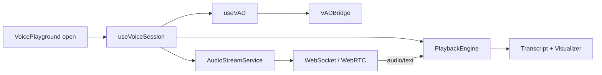
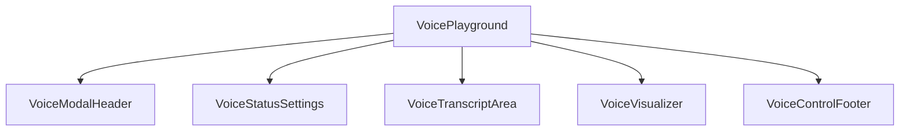

# Voice Playground Feature

## Overview

Modal experience to test the live AI voice assistant using the current persona and widget settings. Bridges UI controls, VAD, playback, and the real-time backend. For low-level protocol and sequence details, see `../VOICE_ARCHITECTURE.md`.

## Flows

### Session Lifecycle

### UI Composition

## Data Contracts

- Transport: WebSocket/WebRTC endpoint handled by `AudioStreamService` (see `VOICE_ARCHITECTURE.md` for protocol).
- Controls: local UI state for mic start/stop, mute, playback, and transcript buffer.
- Persona linkage: playground uses current persona and widget configuration when initializing the session.

## State Ownership

- Voice session: `useVoiceSession` manages connection, sending audio, receiving responses, and transcript buffering.
- VAD: `useVAD` wraps `@ricky0123/vad-web` to gate mic streaming.
- Playback: `useAudioPlayback` and `PlaybackEngine` handle received audio buffers.
- UI: modal open/close state owned by the parent (e.g., `Overview`), internal component state for controls and errors.

## Edge Cases & Constraints

- Graceful teardown on modal close: stop mic, close socket, clear timers.
- Handle VAD false positives/negatives; expose status to the UI.
- Connection failures: surface error state and allow retry without reloading the page.
- Respect persona/widget settings: ensure initialization pulls current config before connecting.

## Testing Notes

- Modal open/close toggles teardown of session resources.
- VAD hook starts/stops streaming correctly when mic toggled.
- Playback engine plays received audio chunks and updates transcript.
- Error handling: backend disconnect or VAD init failure shows user-visible status.
