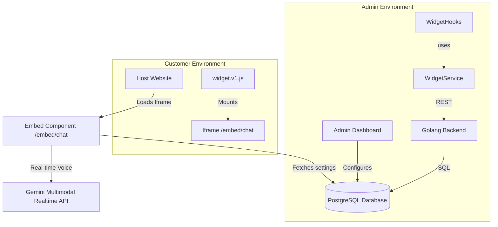
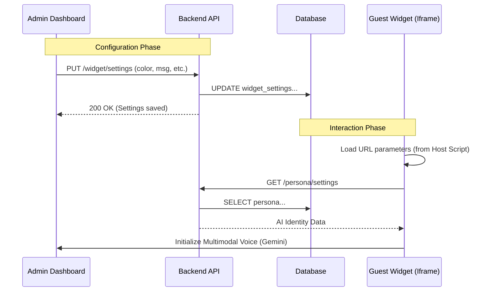
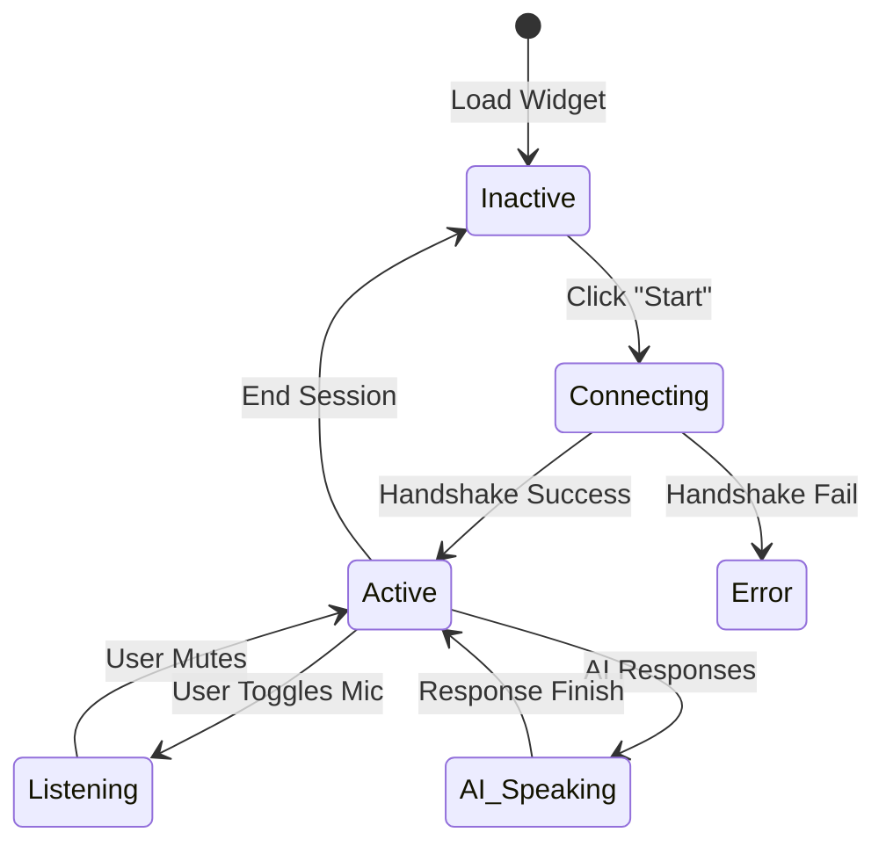

# Widget Configuration Feature

## Overview

Configures the customer-facing TrekDesk AI widget (appearance, persona linkage, allowed origins) and provides the embed script for host sites. Uses a decoupled admin vs. customer runtime.

## Flows

### High-Level Component Graph

### Settings Sync Flow

### Voice Session Lifecycle

## Data Contracts

- Endpoints: `GET /widget/settings`, `PUT /widget/settings`, `GET /persona/settings` (for iframe), voice WS endpoint for live sessions.
- Settings fields: `primary_color`, `position`, `theme`, `welcome_message`, `allowed_origins`, `assistant_name`.
- Validators: shared with persona where applicable; ensure allowed origins validated as URLs.
- Query keys: `["widget", "settings"]` (admin), `["persona", "settings"]` (widget iframe).

## State Ownership

- Server data: TanStack Query hooks for settings fetch/update; persona data shared with widget preview.
- UI state: local form state for color pickers, toggles, and generated embed script.
- Auth: protected routes for admin; iframe uses tokenless public access limited by allowed origins.

## UI Composition

- **WidgetConfig.tsx**: main page; renders config form and embed snippet.
- UI primitives: color pickers, inputs for allowed origins, toggles for theme/position.
- Embed card: shows generated `<script>` tag for host sites.
- Voice preview: ties into persona data to reflect live assistant identity.

## Edge Cases & Constraints

- Allowed origins must be comma-separated valid URLs; block save on invalid domains.
- Persona linkage: embed uses latest persona data; ensure cache invalidation after persona updates.
- Voice lifecycle: tear down audio streams on unmount/reset to avoid leaks.
- Theme/position defaults: fallback to dark/right when unset.

## Testing Notes

- Save flow: valid vs invalid origins, color format (#hex), welcome message length.
- Embed snippet: renders required fields and updates when settings change.
- Iframe fetch: widget loads persona/settings without auth when origin allowed.
- Voice lifecycle: start/stop handshake, error state on failed connection.
