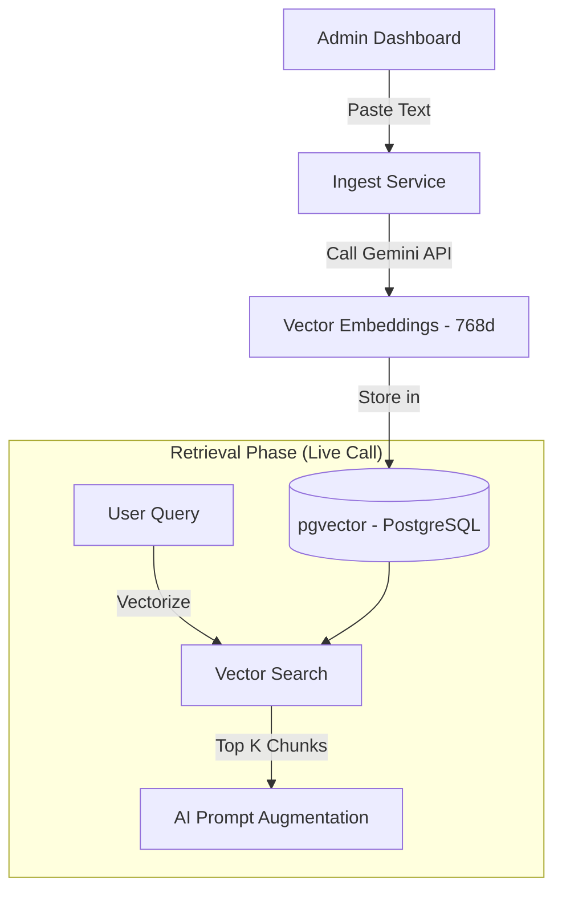
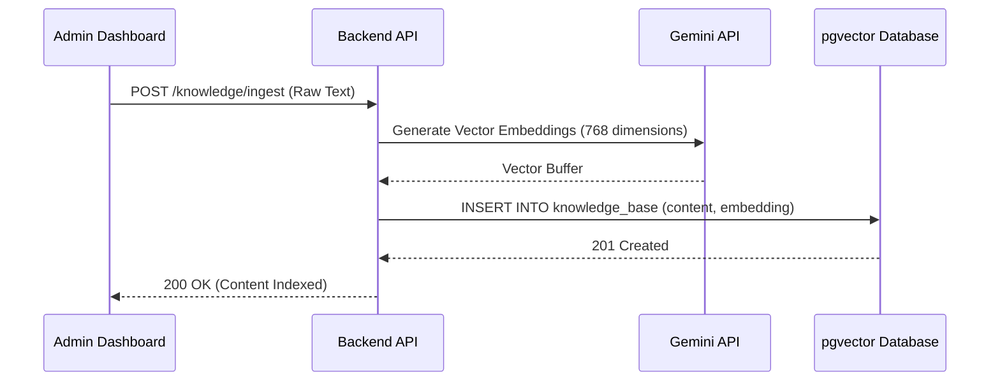
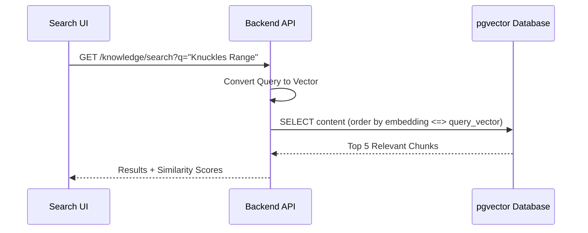

# Knowledge Base & RAG Management Documentation

This document provides a technical overview of the Knowledge Base system in TrekDesk AI, specifically focusing on the RAG (Retrieval Augmented Generation) pipeline orchestration, ingestion, and semantic search features.

## 1. System Architecture (RAG Pipeline)

The Knowledge Base leverages a modern RAG architecture to provide the AI Assistant with context-aware information from custom uploaded content.

### 1.1 High-Level Architecture Graph

---

## 2. Feature Modules

The Knowledge Base is divided into three primary functional areas:

### 2.1 Content Ingestion (`IngestSection`)

Allows administrators to manually add raw text data to the system.

- **Vectorization**: Content is embedded using Gemini's multimodal embedding model.
- **Chunking**: Large texts are split into manageable chunks to optimize retrieval relevance.
- **Stats**: Provides real-time visibility into the total number of indexed vector chunks.

### 2.2 Knowledge Management (`KnowledgeManager`)

A CRUD interface for maintaining the quality of the knowledge base.

- **Inline Editing**: Correcting or updating text re-triggers the embedding process.
- **Auditability**: Each chunk is indexed with a unique ID for traceability.

### 2.3 Semantic Search Test (`SemanticSearch`)

A playground for verifying AI retrieval logic.

- **Manual Trigger**: The search only executes when the **Search** button is clicked or **Enter** is pressed, preventing unnecessary API calls while typing.
- **Similarity Scoring**: Displays the Cosine Similarity percentage (e.g., 85.4%) for each result.
- **Ranking**: Ranks results by relevance to help administrators understand what the AI will "see" during a live call.

---

## 3. Data Flow

### 3.1 Content Ingestion Flow

### 3.2 Semantic Retrieval Flow

---

## 4. Technical Stack

- **Embeddings**: Gemini Text Embeddings (768-dimensional vectors).
- **Database**: PostgreSQL with `pgvector` extension.
- **State Management**: TanStack Query (Key: `["knowledge"]`).
- **UI Framework**: React with Lucide-React icons and CSS Modules.

## 5. Operational Maintenance

To ensure high-quality AI responses, follow these best practices:

1.  **Avoid Redundancy**: If a document is updated, delete the old version to prevent conflicting context.
2.  **Test Queries**: Use the **Semantic Search Test** tab periodically with common customer questions to verify retrieval accuracy.
3.  **Chunk Quality**: Ensure pasted text is clean and lacks excessive formatting noise for better vectorization.
