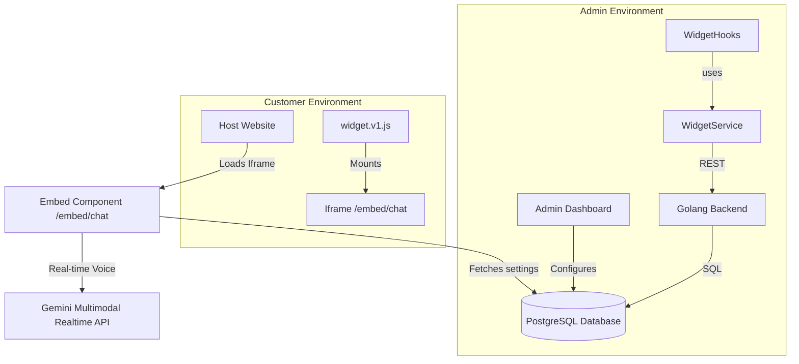
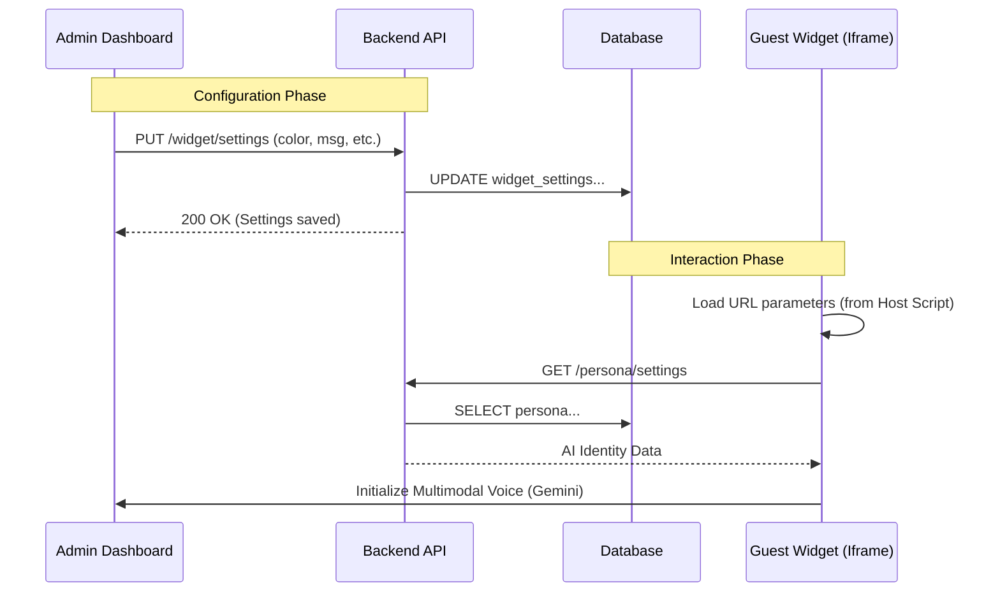
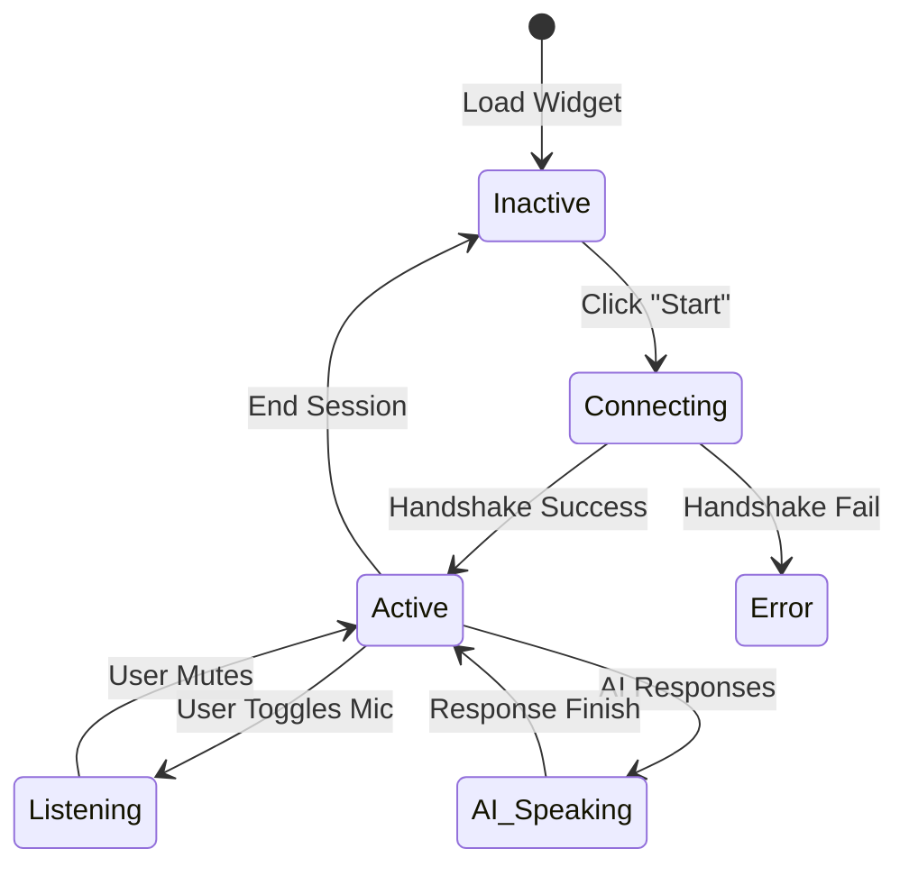

# TrekDesk AI Widget Documentation

This document provides a comprehensive overview of the TrekDesk AI Widget system, including its architecture, configuration options, and integration guide.

## 1. System Architecture

The TrekDesk AI Widget is built using a decoupled architecture that separates the administrative configuration from the customer-facing interaction layer.

### 1.1 High-Level Component Graph



---

## 2. Configuration Guide

The widget is managed via the **Widget Configuration** page in the admin dashboard.

### 2.1 Visual Appearance

| Setting                 | Description                                                                          | Default   |
| :---------------------- | :----------------------------------------------------------------------------------- | :-------- |
| **Primary Brand Color** | The HEX color used for the launcher button, AI sphere waves, and action buttons.     | `#10b981` |
| **Widget Position**     | Where the widget launcher appears on the host screen (`left` or `right`).            | `right`   |
| **Theme**               | Current support is for **Dark (Glassmorphism)**, providing a premium translucent UI. | `dark`    |

### 2.2 Messaging & Persona

The widget leverages the **Persona** system to define its identity.

- **Assistant Name**: Pulled from the active Persona settings.
- **Welcome message**: The introductory text shown to the user before they begin a voice session.

### 2.3 Security (CORS/Origins)

To prevent unauthorized use of your widget, you can specify **Allowed Domains**.

- **Validation**: Enter comma-separated values (e.g., `https://example.com`).
- **Enforcement**: The backend checks the `Origin` header of requests against this list.

---

## 3. Data Flow

The following sequence diagram illustrates how settings are synchronized from the dashboard to the end-user's browser.



---

## 4. Integration Guide

To enable TrekDesk AI on any website, users follow a two-step process provided in the "Embed Script" card.

### 4.1 Integration Steps

1.  **Copy the Script**: The dashboard generates a unique `<script>` tag pointing to your tenant environment.
2.  **Paste in Body**: Place the script before the closing `</body>` tag.

### 4.2 Generated Script Structure

```html
<!-- TrekDesk AI Widget -->
<script src="https://api.trekdesk.ai/static/widget.v1.js"></script>
<script>
  window.TrekDeskAI.init({
    color: "#10b981",
    msg: "Hi! How can I help you today?",
    position: "right",
    name: "TrekDesk AI",
  });
</script>
```

---

## 5. Voice Session Lifecycle

The widget utilizes a real-time multimodal engine for high-fidelity voice interactions.

### 5.1 Communication Flow

1.  **Handshake**: On "Start Voice Chat", the widget establishes a WebSocket/WebRTC connection.
2.  **Greeting**: The AI sends an initial audio buffer based on the `initial_message` configuration.
3.  **Active State**: The user's microphone is toggled via the `Mic` button. The AI sphere visualizes voice waves using a CSS-based animation driven by audio intensity data.
4.  **Graceful Termination**: When "Reset" is clicked, or the component unmounts, the local stream is destroyed to protect user privacy.

### 5.2 Internal Logic Graph



---

## 6. Technical Stack

- **Frontend Framework**: React 18+
- **Styling**: CSS Modules (Glassmorphism design)
- **State Management**: TanStack Query (React Query)
- **Voice Engine**: Real-time Multimodal WebRTC/WebSockets
- **Icons**: Lucide React
