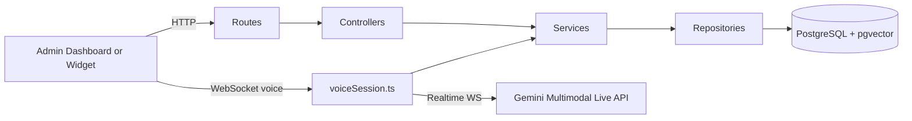
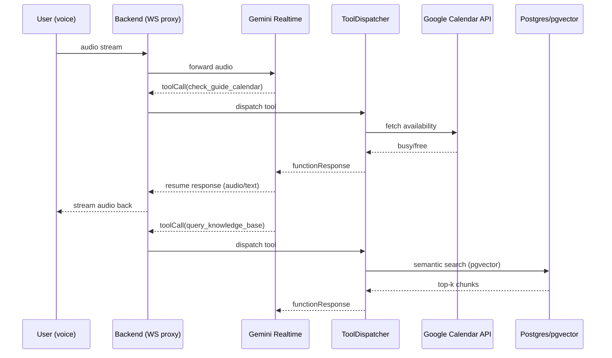

# TrekDesk AI — Backend

Node.js (Express + TypeScript) backend powering TrekDesk AI: authentication, tours, knowledge base (RAG), widget messaging, call logs/analytics, and real-time voice sessions via Gemini Multimodal Live API over WebSockets.

## Tech Stack

- Runtime: Node.js + TypeScript
- Framework: Express
- Auth: Google OAuth (ID token verification) + JWT
- Validation: Zod (request payloads + env validation)
- Database: PostgreSQL + `pgvector` (RAG)
- Migrations: `node-pg-migrate`
- Realtime transport: WebSockets (`ws`)
- API docs: Swagger (`swagger-jsdoc` + `swagger-ui-express` at `/api-docs`)

## High-Level Idea

- **Layered architecture:** Routes → Controllers → Services → Repositories (`docs/ARCHITECTURE.md`).
- **Multi-tenancy:** most operations are scoped by `tenantId` (MVP uses a fixed `MVP_TENANT_ID`).
- **Real-time voice:** backend proxies a client WebSocket to Gemini realtime WebSocket and dispatches tool calls (`docs/REALTIME_VOICE_AI.md`).
- **RAG:** ingestion + pgvector semantic retrieval exposed via tool calling during live sessions (`docs/RAG_PIPELINE.md`).



## Major Functionality (MVP)

- **Authentication + session JWTs:** Google OAuth ID token exchange → backend JWT (`docs/AUTHENTICATION.md`).
- **Whitelist-only admin access:** restricted by `GOOGLE_AUTH_WHITELIST` in `src/config/constants.ts`.
- **Rate limiting:** global API limiter + stricter auth limiter in `src/app.ts`.
- **Tours CRUD:** tenant-scoped trek catalog (`docs/features/FEATURE_TOURS.md`).
- **Knowledge Base (RAG):** ingest → embed → store (pgvector) → semantic retrieval (`docs/features/FEATURE_KNOWLEDGE_BASE.md`).
- **Conversations + analytics:** persist call logs/transcripts and expose review endpoints (`docs/features/FEATURE_CONVERSATIONS.md`).
- **Developer diagnostics:** traced prompt execution and tool registry endpoints (dev-only) (`docs/features/FEATURE_DIAGNOSTICS.md`).
- **Calendar availability:** guide availability checks via Google Calendar API (used by AI tool calls; see below).

## Tool Calling (Agent Actions) + Calendar Integration

During real-time sessions, Gemini can pause generation and request a backend “tool” to be executed (availability checks, quotes, knowledge search, bookings). Tool definitions live in `src/config/tools.ts` and execution is routed through `ToolDispatcher`.

Calendar is integrated via `@googleapis/calendar` and is typically used by the `check_guide_calendar` tool to answer availability questions during live calls.



## Widget Embed & Domain Locking

- **Static loader script:** `GET /static/widget.v1.js`
- **Widget embed wrapper (HTML):** `GET /api/v1/widget/embed/chat?agentId=<tenantId>&apiUrl=<apiBaseUrl>&color=<hex>&msg=<text>&name=<text>`
  - Returns an iframe wrapper so the backend can apply security headers before loading the frontend widget route (`/embed/chat`).
- **Domain name locking:** widget requests validate `Origin` against `allowed_origins` in `widget_settings`, and CSP `frame-ancestors` is derived dynamically (`docs/features/FEATURE_WIDGET.md`).

## Models Used

Configured in env (see `./.env.example`):

- **Realtime voice model:** `GEMINI_MODEL_NAME`
- **Embeddings model:** `GEMINI_EMBEDDING_MODEL`

## Environment Setup

Environment is validated at boot via Zod (`src/config/env.ts`). Start with:

```bash
cp .env.example .env
```

Key groups:

- **Database:** `DATABASE_URL`
- **Gemini:** `GEMINI_API_KEY`, `GEMINI_MODEL_NAME`, `GEMINI_EMBEDDING_MODEL`, `GEMINI_WS_URL`
- **Google OAuth / Calendar:** `GOOGLE_CLIENT_ID`, `GOOGLE_CLIENT_SECRET`, `GOOGLE_REFRESH_TOKEN`, `GOOGLE_CALENDAR_API_KEY`
- **Security:** `JWT_SECRET`
- **Dev login:** `ENABLE_DEVELOPMENT_LOGIN`, `DEV_AUTH_SECRET`

Cloud SQL proxy guidance: `docs/CLOUD_SQL_SETUP.md`.

## Migrations & Setup

```bash
npm run migrate:up
```

Also ensure `pgvector` is enabled (see `docs/CLOUD_SQL_SETUP.md` and `docs/DATABASE_SCHEMA.md`).

## API Reference

Swagger UI is the source of truth:

- `http://localhost:<PORT>/api-docs`

## Docs

Start here: `docs/README.md`.

## Common Commands

```bash
npm run dev
npm run build
npm run migrate:up
```
