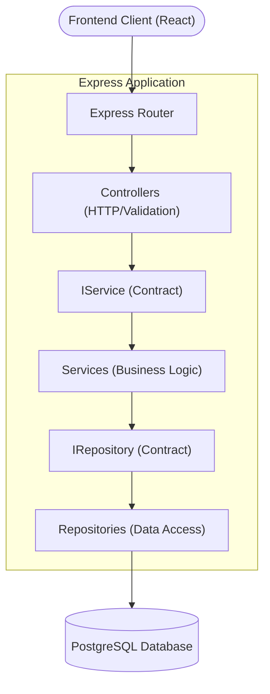
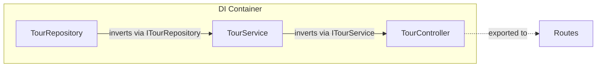

# 01 System Architecture

## Overview

The TrekDesk AI backend is built on Node.js using Express and TypeScript. The system is designed following the **Dependency Inversion Principle (DIP)** and strict layered architecture to ensure modularity, testability, and clear separation of concerns.

## The Layered Architecture

The application is structured into four distinct layers following the Dependency Inversion Principle:

1.  **Controllers (`src/controllers`):** Handle incoming HTTP requests, extract parameters, and validate them using Zod schemas. They delegate all business logic to Services.
2.  **Services (`src/services`):** The Business Logic Layer (BLL). Services handle the core application logic, orchestration of multiple repositories, and external integrations (like Gemini or Google Calendar).
3.  **Interfaces (`src/interfaces`):** Define the contracts for Services and Repositories. This layer allows for decoupling, as components depend on abstractions rather than concrete implementations.
4.  **Repositories (`src/repositories`):** The Data Access Layer (DAL). Repositories are responsible for database interactions using parameterized SQL queries.



## Dependency Injection (DI)

To avoid tight coupling, we do not use static methods or hard-coded instantiations inside classes. Instead, we use Constructor-based Dependency Injection.

### Interfaces

Each Service and Repository defines an interface in `src/interfaces/services` and `src/interfaces/repositories`. Classes depend on these abstractions rather than concrete implementations.

### The DI Container (`src/config/di.ts`)

The `di.ts` file acts as a central manual wiring hub.



1. It instantiates all repositories.
2. It instantiates services by injecting the required repository instances into their constructors.
3. It instantiates controllers by injecting the required service instances into their constructors.

**Example Wiring Flow:**

```typescript
// 1. Instantiate Repository
export const knowledgeRepository = new KnowledgeRepository();

// 2. Instantiate Service (Injecting Repository)
export const knowledgeService = new KnowledgeService(knowledgeRepository);

// 3. Instantiate Controller (Injecting Service)
export const knowledgeController = new KnowledgeController(knowledgeService);
```

### Express Routes Integration

The Express routing files (`src/routes/*.ts`) import the pre-wired controller singletons directly from the `di.ts` container, ensuring the entire application uses the correctly initialized instances.

## Tenancy Isolation

Currently, the system is designed to handle multiple tenants (e.g., different tour operator clients). While we default to an `MVP_TENANT_ID` for the initial Kandy Treks pilot, nearly all service and repository methods require a `tenantId` parameter to ensure strict data scoping.
