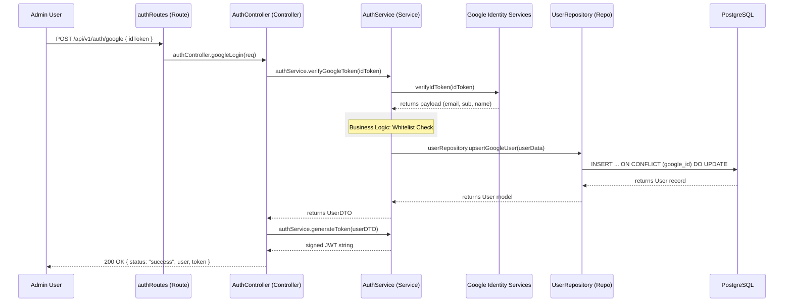

# 02 Authentication Flow & Architecture

## Overview

The TrekDesk AI backend implements a production-grade authentication system using **Google OAuth 2.0** for identity and **JSON Web Tokens (JWT)** for session persistence. The system follows a modular, layered architecture that separates concerns between routing, request handling, business logic, and data access.

---

## 🏗️ Layered Architecture

The authentication flow is distributed across four distinct layers:

| Layer          | Component           | Responsibility                                                                                      |
| :------------- | :------------------ | :-------------------------------------------------------------------------------------------------- |
| **Route**      | `authRoutes.ts`     | Maps HTTP endpoints to controller methods and applies rate limiting/middleware.                     |
| **Controller** | `AuthController.ts` | Handles HTTP specifics (parsing bodies, validating basic input, sending standard `ApiResponse`).    |
| **Service**    | `AuthService.ts`    | Orchestrates business logic: Google token verification, whitelist checks, and user synchronization. |
| **Repository** | `UserRepository.ts` | Performs atomic database operations (e.g., `upsertGoogleUser`).                                     |

---

## 🔄 Sequence: Google Login (End-to-End)

This diagram illustrates how a request flows through the internal layers.

---

## 🛠️ Layer Responsibilities

### 1. Route Layer (`authRoutes.ts`)

The entryway. It applies:

- **Rate Limiting**: Uses `authLimiter` to prevent brute-force attacks.
- **Dependency Injection**: Uses `authController` instance from the `di.ts` container.
- **Route Definitions**: Defines `/google`, `/verify`, and `/dev-login`.

### 2. Controller Layer (`AuthController.ts`)

The "Traffic Cop". It doesn't know about Google's crypto details or DB schemas. Its job is:

- To extract the `idToken` from `req.body`.
- To handle initial validation (e.g., returning `400 Bad Request` if token is missing).
- To call the `AuthService` and format the success response using the `ApiResponse` utility.

### 3. Service Layer (`AuthService.ts`)

The "Brain". This is where the core authentication logic lives:

- **verification**: Uses `google-auth-library` to check the signature of the `idToken`.
- **Authorization (Whitelist)**: Checks if the user's email is in the `GOOGLE_AUTH_WHITELIST` defined in `constants.ts`.
- **Identity Sync**: Orchestrates the storage of the user profile via the repository.
- **Session Issue**: Signs internal JWTs using the `JWT_SECRET` with a 7-day expiration.

### 4. Repository Layer (`UserRepository.ts`)

The "Data Guard". It handles the raw SQL/ORM logic.

- Ensures user records are updated if their Google name or picture changes.
- Maps database rows (snake_case) to domain objects.

---

## 🔐 Security Key Features

### Whitelist-Only Access (MVP)

For the current phase, authentication is restricted. Even if someone has a valid Google account, the `AuthService` will reject them (returning `null`) if their email isn't explicitly whitelisted.

### Stateless JWT Sessions

The backend does not store sessions in a database. Instead, the `authMiddleware` verifies the JWT signature on every protected request.

- **Payload**: Contains `id`, `email`, and `tenantId`.
- **Verification**: If the signature is invalid or the token is expired, the middleware throws an `UnauthorizedError`.

### Developer Bypass (`dev-login`)

Only available when `NODE_ENV=development`.

- Takes a `DEV_AUTH_SECRET`.
- Issues a real JWT for a mock "Dev Admin" user.
- **Implementation**: Handled by `DevAuthController` and `DevAuthService` to keep production code clean.
