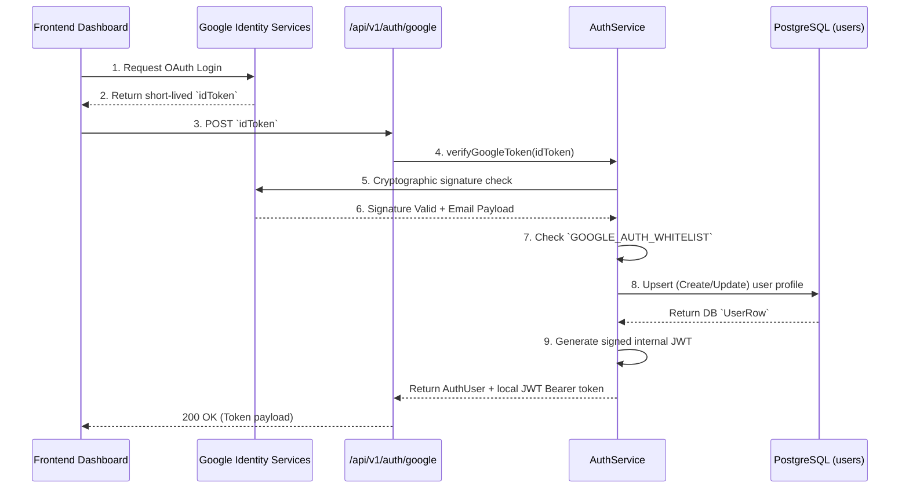

# 02 Authentication Flow

## Overview

The backend uses **JSON Web Tokens (JWT)** for stateless API authentication and **Google OAuth2** as the primary Single Sign-On (SSO) provider for administration and dashboard access.

## Google Login Flow

## Google Login Flow

1.  **Client Kickoff:** The frontend dashboard opens the Google Sign-In prompt.
2.  **ID Token Retrieval:** Upon successful login, Google gives the frontend an `idToken`.
3.  **Backend Verification (`POST /api/v1/auth/google`):** The frontend sends this `idToken` to our backend.
4.  **Google Verification:** Our `AuthService` uses the `google-auth-library` to ping Google's servers and crypto-verify that the token is valid, wasn't tampered with, and belongs to our registered OAuth application client ID.
5.  **Whitelist Check:** We extract the user's email. For the MVP, we check this email against a hardcoded `GOOGLE_AUTH_WHITELIST`. Only approved administrators can log in.
6.  **Database Sync:** We "upsert" (insert or update) the user's details (Name, Email, Google subject ID) into our `users` database table.
7.  **JWT Issue:** We generate our own signed JWT containing the user's ID, email, and role (`admin`). We send this JWT back to the client.

## Standard Request Authentication (Middleware)

For all protected routes (e.g., querying call logs or changing AI persona settings), the frontend must attach the issued JWT to the `Authorization: Bearer <token>` header.

The `authMiddleware` intercepts the request:

1. Checks for the `Bearer ` header.
2. Uses `AuthService.verifyJWToken` to cryptographically verify our backend signature.
3. Decodes the payload and attaches the `AuthUser` object to the Express `req.user` property.
4. Calls `next()` if successful, or returns a `401 Unauthorized` if the token is missing, tampered with, or expired.

---

## Developer Bypass Login (Dev mode only)

For local development and automated testing, the backend provides a simplified secret-based login flow.

**Endpoint:** `POST /api/v1/auth/dev-login`

**Flow:**

1. Client sends a plaintext `secret` (matching the backend's `DEVELOPMENT_WIDGET_SECRET` env var).
2. `DevAuthService` validates the secret.
3. If valid, an internal developer user session is generated.
4. A standard JWT is issued to the client.

> ⚠️ **Security Warning:** This flow is automatically disabled if `NODE_ENV=production` or if the `DEVELOPMENT_WIDGET_SECRET` environment variable is not set.
