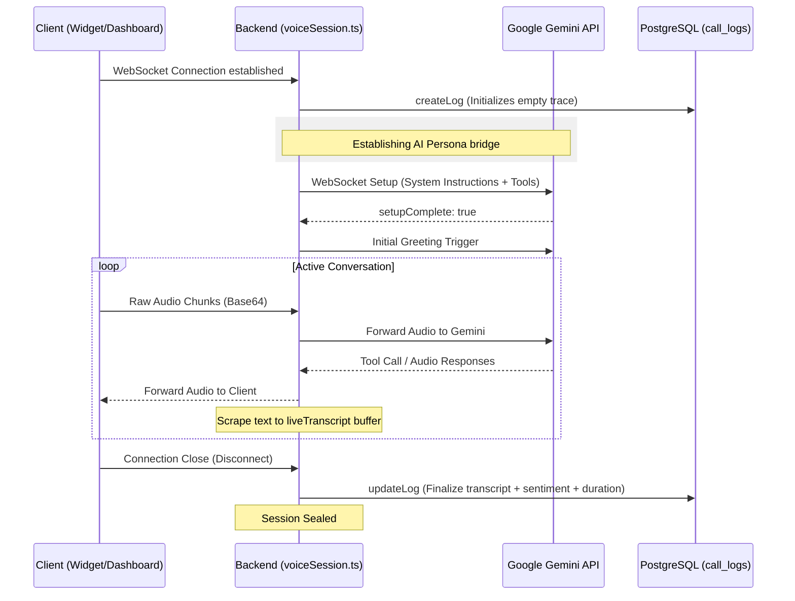

# 04 Conversation & Call Log Flow

## Overview

The TrekDesk AI platform features a robust, real-time voice interaction system powered by **Google Gemini Multimodal Live API**. This document outlines the end-to-end flow from a live voice session to its persistence and eventual review on the Admin Dashboard.

---

## 🏗️ System Architecture

The conversation system is divided into two main components:

1.  **Real-time Voice Engine**: WebSocket-based bidirectional audio streaming.
2.  **Management API**: RESTful endpoints for reviewing historical transcripts and analytics.

### File Structure & Responsibilities

| Component             | Location               | Responsibility                                                                    |
| :-------------------- | :--------------------- | :-------------------------------------------------------------------------------- |
| **Frontend Hook**     | `useVoiceSession.ts`   | Handles microphone capture, audio playback, and primary WebSocket lifecycle.      |
| **Socket Handler**    | `voiceSession.ts`      | Orchestrates the bridge between the Client and Gemini, managing session identity. |
| **Gemini Service**    | `GeminiService.ts`     | Specialized wrapper for the Google Generative Language WebSocket protocol.        |
| **Analytics Service** | `CallLogService.ts`    | Business logic for transcript processing, sentiment analysis, and record sealing. |
| **Logs Repository**   | `CallLogRepository.ts` | Direct SQL access to the `call_logs` table (JSONB transcripts).                   |
| **Dashboard UI**      | `Conversations.tsx`    | Split-pane interface for browsing logs and reviewing conversation details.        |

---

## 🔄 Sequence: Real-time Voice Session

This diagram illustrates how a voice session is established, proxied, and finally recorded.



---

## 📊 Conversation Management API

Once a session is completed, it is available via the **REST API** for the Admin Dashboard.

### 1. Endpoint: `GET /api/v1/analytics/calls`

- **Controller**: `getLogs`
- **Action**: Returns a paginated list of sessions for the tenant.
- **Data**: Includes summary, duration, and sentiment score for the side-panel list.

### 2. Endpoint: `GET /api/v1/analytics/calls/:logId`

- **Controller**: `getLogDetail`
- **Action**: Returns the full `JSONB` transcript thread.
- **Frontend Handling**: `Conversations.tsx` parses this array and renders role-based message bubbles.

---

## 🛠️ Key Implementation Details

### Transcript Data Structure

Transcripts are stored as a structured array of messages to support rich UI rendering:

```json
[
  { "role": "ai", "text": "Hello! How can I help you today?" },
  { "role": "user", "text": "I'm interested in the Kandy Trek." }
]
```

### Protocol Normalization

The `GeminiService` handles the transition between different data protocols:

- **Incoming from Gemini**: Uses `serverContent.modelTurn` for audio/text.
- **Tool Responses**: Formats local function results into the snake_case `tool_response` required by Google's preview endpoint.
- **Client Fallback**: The frontend `Conversations` component includes a "Legacy Adapter" to ensure that sessions recorded with older versions of the backend (stored as raw objects) still render correctly.

### Sentiment Analysis (MVP)

Currently, `CallLogService` performs keyword-based statistical analysis:

- **Positive Keywords**: "book", "amazing", "interested" -> Score 0.8 (**Hot Lead**).
- **Negative Keywords**: "expensive", "no thanks", "bad" -> Score 0.3.
- **Default**: 0.5 (**Neutral Inquiry**).
