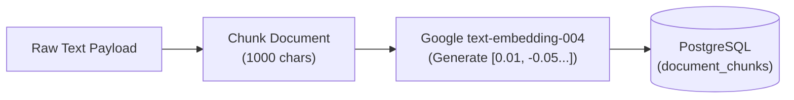

# 04 Retrieval-Augmented Generation (RAG) Pipeline

## Overview

The backend includes a fully functional RAG pipeline to give the AI access to proprietary business knowledge (e.g., specific trek itineraries, pricing, company FAQs, safety guidelines). This ensures the AI provides factual answers rather than hallucinating generic advice.

This pipeline consists of three phases: Ingestion, Retrieval, and Live Integration.

## 1. Document Ingestion (Storing Knowledge)



To make documents searchable by the AI, we must convert them into vector embeddings.

- **API Endpoint:** `POST /api/v1/knowledge/ingest`
- **Service Processing (`KnowledgeService.ts`):**
  1.  **Chunking:** The service takes a large text payload (e.g., a PDF extracted string) and splits it into smaller segments using `simpleChunk`. Currently, this is a fixed-size split (1,000 chars per chunk).
  2.  **Embedding:** We use Google's `text-embedding-004` model to convert each text chunk into a high-dimensional mathematical vector array (the "embedding").
- **Database Storage (`KnowledgeRepository.ts`):** The repository inserts the raw text chunk, its embedding vector, and any metadata (like an associated `trekId`) into the PostgreSQL `document_chunks` table.

## 2. Knowledge Retrieval (Finding Answers)

```mermaid
flowchart TD
    Query["User Question"] --> Embedding["Google text-embedding-004\n(Generate Query Vector)"]
    Embedding --> DB[("pgvector Database")]

    subgraph Cosine Distance Search `<=>`
        DB -- "Compare against\nall stored chunks" --> TopK["Select Top 3\nClosest Matches"]
    end

    TopK --> Results["Return raw text to AI"]
```

When a user asks a complex question, we search our vector space for the most mathematically similar text chunks.

- **Service Processing:** The user's query is converted into a vector embedding using the same `text-embedding-004` model.
- **Database Search (`KnowledgeRepository.ts`):** The repository executes a semantic (vector) search query inside PostgreSQL. We use the `<=>` operator (Cosine Distance) to compare the "query vector" against all stored "document vectors". We order by the closest match and return the top 3 (`LIMIT 3`) text chunks.

## 3. Live AI Integration (The RAG Execution)

The RAG pipeline operates transparently during a live voice call via the Gemini Multimodal Live API.

1.  **Tool Definition:** We define a `query_knowledge_base` tool and send its definition to Google when opening the WebSocket.
2.  **AI Invocation:** If Gemini encounters a question it cannot definitively answer from its system instruction, it pauses audio generation and invokes the `query_knowledge_base` tool over the WebSocket.
3.  **Local Execution:** The `ToolDispatcher` catches this invocation, triggers the Retrieval process (Step 2) using the AI's formulated query, and sends the resulting text chunks back up the WebSocket.
4.  **Audio Generation:** Gemini instantly reads these injected facts and generates an accurate, context-aware audio response based on the true retrieved data.
