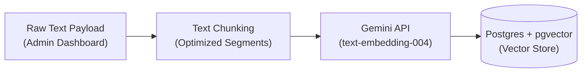
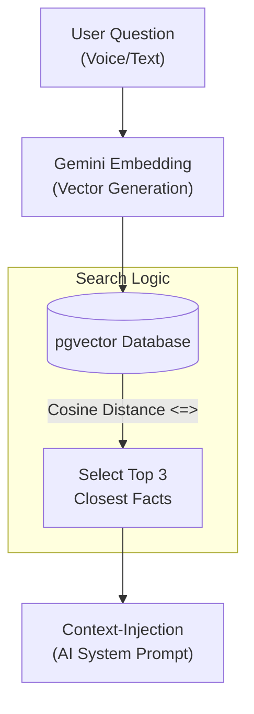

# 05 Retrieval-Augmented Generation (RAG) Pipeline

## Overview

The backend includes a fully functional Retrieval-Augmented Generation (RAG) pipeline. This system bridges the gap between static AI training and proprietary business knowledge (e.g., specific trek itineraries, pricing, company FAQs). By retrieving relevant facts in real-time, we eliminate hallucinations and provide strictly factual AI responses.

This pipeline consists of three phases: **Administrative Ingestion**, **Semantic Retrieval**, and **Live Session Integration**.

## 1. Document Ingestion (Storing Knowledge)

Managed via the **TrekDesk Admin Dashboard**, this phase prepares business intelligence for AI consumption.

- **API Endpoint:** `POST /api/v1/knowledge/ingest`
- **Service Processing (`KnowledgeService.ts`):**
  1.  **Chunking:** Large text payloads are split into segments (standard ~1000 characters) to ensure high-fidelity retrieval without exceeding AI context windows.
  2.  **Embedding:** We use Google's `text-embedding-004` model to convert chunks into 768-dimensional mathematical vectors.
- **Database Storage (`KnowledgeRepository.ts`):** Chunks are stored in the `knowledge_chunks` table with a `vector` column indexed for fast nearest-neighbor search.

## 2. Knowledge Retrieval (Finding Answers)

When a question is asked, we search our vector space for the most mathematically similar text chunks using **Cosine Similarity**.

- **Query Transformation:** The user's query is vectorized in real-time using the same embedding model.
- **Semantic Search:** The repository executes a query using the `<=>` operator (Cosine Distance). Unlike keyword search, this finds **meaning** even if the words don't match exactly.

## 3. Live AI Integration (Tool Calling)

The RAG pipeline operates transparently during live sessions via the Gemini Multimodal Live API.

1.  **Tool Definition:** The `query_knowledge_base` tool is declared to the AI model.
2.  **AI Invocation:** If the AI needs factual data, it pauses and emits a `tool_call` request.
3.  **Local Execution:** The `ToolDispatcher` executes the search (Step 2) and feeds the text back to the model.
4.  **Response:** The AI integrates these facts into its natural language response, ensuring 100% accuracy.

## See Also

- [13 Knowledge Base Technical Flow](./13_Knowledge_Base_Technical_Flow.md) - Deep dive into code-level implementation.
- [06 Database Schema](./06_Database_Schema.md) - Detailed table structure for `knowledge_chunks`.
