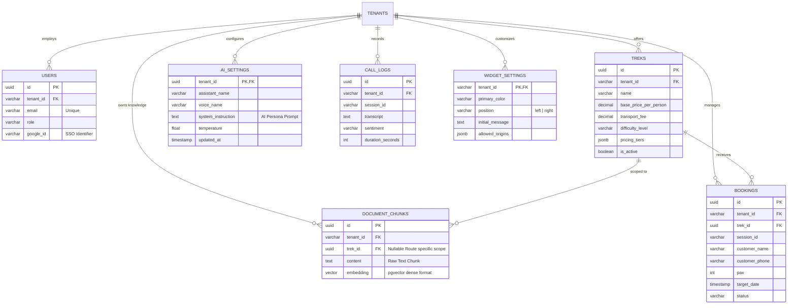

# 06 Database Schema

## Overview

The TrekDesk AI backend uses a PostgreSQL database. The schema is designed to support multi-tenancy (via the `tenant_id` column) and includes standard relational tables alongside vector storage for RAG (via `pgvector`).

Migrations are managed using `node-pg-migrate`.

## Entity Relationship Diagram (ERD)

## Tables

### `users`

Stores all administrative users who can log into the dashboard.

- `id` (UUID, Primary Key)
- `tenant_id` (VARCHAR, Foreign Key to a future tenants table)
- `email` (VARCHAR, Unique)
- `name` (VARCHAR)
- `role` (VARCHAR, e.g., 'admin', 'agent')
- `google_id` (VARCHAR) - Used for SSO verification
- `created_at` (TIMESTAMP)
- `updated_at` (TIMESTAMP)

### `treks`

Stores predefined tour itineraries and packages offered by the operator.

- `id` (UUID, Primary Key)
- `tenant_id` (VARCHAR)
- `name` (VARCHAR) - e.g., "Knuckles Base Camp"
- `description` (TEXT)
- `base_price_per_person` (DECIMAL)
- `transport_fee` (DECIMAL) - Fixed overhead fee per booking
- `difficulty_level` (VARCHAR) - 'easy', 'moderate', 'challenging', 'extreme'
- `pricing_tiers` (JSONB) - Dynamic pricing based on group size
- `is_active` (BOOLEAN)
- `created_at` (TIMESTAMP)
- `updated_at` (TIMESTAMP)

### `document_chunks`

Stores vectorized knowledge base entries for the RAG pipeline. This table utilizes the `pgvector` extension.

- `id` (UUID, Primary Key)
- `tenant_id` (VARCHAR)
- `trek_id` (UUID, nullable) - Links specific chunks to specific treks.
- `content` (TEXT) - The actual readable knowledge slice.
- `embedding` (VECTOR) - High dimensional vector representation generated by Gemini `text-embedding-004`.
- `metadata` (JSONB) - Flexible storage for source URLs, categories, etc.
- `created_at` (TIMESTAMP)

### `ai_settings`

Stores the prompt engineering parameters tailored for a specific tenant's voice agent.

- `tenant_id` (UUID, Primary Key, Foreign Key)
- `assistant_name` (VARCHAR) - Custom display name for the AI
- `system_instruction` (TEXT) - The core prompt dictating the AI's behavior
- `voice_name` (VARCHAR) - Gemini Voice engine ID (e.g., 'Aoede', 'Puck')
- `temperature` (FLOAT) - Controls response creativity (0.0 to 2.0)
- `updated_at` (TIMESTAMP)

### `call_logs`

Stores the metadata for completed AI voice sessions for dashboard analytics.

- `id` (UUID, Primary Key)
- `tenant_id` (VARCHAR)
- `call_date` (TIMESTAMP)
- `duration_seconds` (INTEGER)
- `caller_identifier` (VARCHAR)
- `summary` (TEXT) - Auto-generated post-call summary.
- `sentiment` (VARCHAR) - 'positive', 'neutral', 'negative'
- `actions_taken` (JSONB)
- `created_at` (TIMESTAMP)

### `bookings`

Stores reservations and bookings made by users or directly by the AI agent during a call.

- `id` (UUID, Primary Key)
- `tenant_id` (VARCHAR)
- `trek_id` (UUID, Foreign Key) - Links to the specific trek booked.
- `session_id` (VARCHAR, nullable) - Links to the `call_logs` session if created via AI.
- `customer_name` (VARCHAR)
- `customer_email` (VARCHAR, nullable)
- `customer_phone` (VARCHAR)
- `pax` (INTEGER) - Number of participants.
- `target_date` (DATE/TIMESTAMP)
- `status` (VARCHAR/ENUM) - e.g., 'pending', 'confirmed', 'cancelled'.
- `created_at` (TIMESTAMP)
- `updated_at` (TIMESTAMP)

### `widget_settings`

Stores the customization settings for the frontend chat widget.

- `tenant_id` (VARCHAR, Primary Key, Foreign Key)
- `primary_color` (VARCHAR(7)) - Hex code for widget branding
- `position` (VARCHAR) - 'left' or 'right'
- `initial_message` (TEXT) - The first message the widget displays
- `allowed_origins` (JSONB) - List of domains permitted to embed this widget
- `updated_at` (TIMESTAMP)
