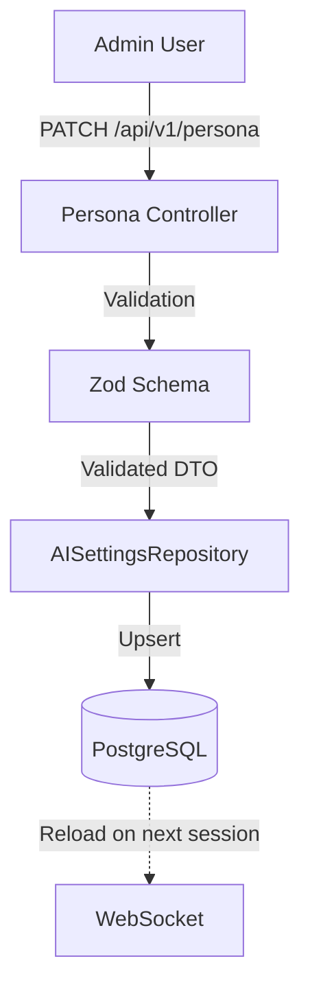
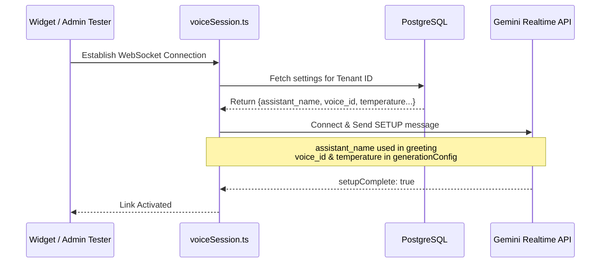

# 10 AI Persona Architecture

## Overview

The AI Persona module defines the "Soul and Identity" of the TrekDesk Assistant. It allows tenant administrators to configure how the AI behaves, what voice it uses, its level of creativity, and its primary mission.

This configuration is stored in the database and injected into every real-time voice session established with the Google Gemini Multimodal Live API.

## Core Configuration Parameters

| Parameter              | Database Column      | Description                                                                    | Gemini Counterpart               |
| :--------------------- | :------------------- | :----------------------------------------------------------------------------- | :------------------------------- |
| **Assistant Name**     | `assistant_name`     | The human-readable name (e.g., "KandyGuide"). Used in greetings and widget UI. | Passed as text in setup greeting |
| **Gemini Voice**       | `voice_name`         | The specific prebuilt vocal profile ID (e.g., "Aoede", "Hera").                | `prebuiltVoiceConfig.voiceName`  |
| **System Instruction** | `system_instruction` | The core behavior prompt / system message.                                     | `systemInstruction`              |
| **Temperature**        | `temperature`        | Controls randomness (0.0 = Deterministic, 2.0 = Creative).                     | `generationConfig.temperature`   |

## Architectural Diagrams

### 1. Configuration Lifecycle

This flow shows how the Admin Dashboard interacts with the Persistence Layer to update the AI's "identity".



### 2. Session Initialization Sequence

This sequence illustrates how a dynamic persona is injected into a live streaming session at the moment of connection.



## Data Flow Architecture

### 1. Persistence Layer (`src/repositories/AISettingsRepository.ts`)

The settings are persisted in the `ai_settings` table, which is keyed by `tenant_id` to support multitenancy. Every update uses an **Upsert (ON CONFLICT)** strategy to ensure only one active persona exists per tenant.

### 2. Retrieval & Injection (`src/sockets/voiceSession.ts`)

When a user connects to the voice WebSocket (`/voicesession`):

1. The `handleVoiceConnection` function fetches the latest settings from the repository using the tenant UUID.
2. It constructs an `AISettings` object.
3. This object is passed to `geminiService.connectToGemini`.

### 3. API Setup (`src/services/GeminiService.ts`)

During the Gemini WebSocket handshake, the settings are transformed into the **Setup Message**:

```typescript
const setupMessage = {
  setup: {
    model: "...",
    systemInstruction: {
      parts: [{ text: settings.systemInstruction }],
    },
    generationConfig: {
      temperature: settings.temperature,
      speechConfig: {
        voiceConfig: {
          prebuiltVoiceConfig: {
            voiceName: settings.voiceName,
          },
        },
      },
    },
  },
};
```

## Real-time Persona Updates

Because configurations are loaded at the **start** of a session, changes made in the Admin Dashboard will apply to all **new** calls immediately. Existing active calls will continue using the instructions they were initialized with (ensuring behavioral consistency during a single conversation).

## Multi-Name Strategy

The system distinguishes between the **Assistant Name** (Display) and **Voice Name** (Engine):

- **Assistant Name**: "Hi, I'm Sarah from TrekDesk" (Configured by admin).
- **Voice Name**: "Aoede" (Technical engine ID from Google).

This separation allows for a user-friendly customization experience while maintaining technical compatibility with the Gemini API.
