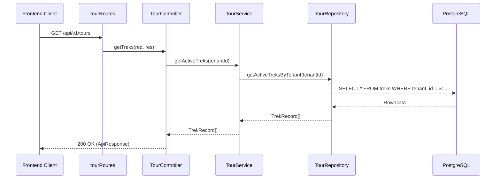

# Tour Management Backend Architecture

## Overview

The **Tour Management** backend provides the core API for managing trekking itineraries. It follows a strictly layered architecture to ensure separation of concerns, multi-tenant security, and testability.

## Layered Architecture

The implementation is divided into four distinct layers:

### 1. Routing Layer (`tourRoutes.ts`)

Defines the RESTful endpoints and attaches middleware for authentication and payload validation.

- **Base Path**: `/api/v1/tours`
- **Validation**: Uses Zod schemas to ensure incoming request bodies match expected types before reaching the controller.

### 2. Controller Layer (`TourController.ts`)

Responsible for parsing HTTP requests, extracting parameters, and delegating business logic to the Service layer.

- **Multi-tenancy**: Injects `MVP_TENANT_ID` into DTOs to ensure data isolation.
- **Responses**: Uses a standardized `ApiResponse` utility for consistent JSON output.

### 3. Service Layer (`TourService.ts`)

Maintains the business logic and orchestrates data movement between the Controller and Repository.

- **Interfaces**: Implements `ITourService` for improved abstraction.
- **Logic**: Handles logic like filtering active treks or preparing data for persistence.

### 4. Repository Layer (`TourRepository.ts`)

The only layer that interacts directly with the PostgreSQL database.

- **SQL Queries**: Uses prepared statements via the `query` utility to prevent SQL injection.
- **Data Integrity**: Ensures all queries are scoped by `tenant_id` to maintain strict multi-tenant isolation.

## Data Flow Diagram



## API Endpoints

| Method   | Endpoint   | Description             | Layer Delegation           |
| :------- | :--------- | :---------------------- | :------------------------- |
| `GET`    | `/`        | List all active treks   | `getActiveTreksByTenant`   |
| `GET`    | `/:trekId` | Detailed view of a trek | `getTrekByIdAndTenant`     |
| `POST`   | `/`        | Create a new trek       | `createTrek`               |
| `PATCH`  | `/:trekId` | Update an existing trek | `updateTrek`               |
| `DELETE` | `/:trekId` | Remove a trek           | `deleteTrek` (Hard Delete) |

## Implementation Details

### Multi-Tenant Guard

Every database operation in the `TourRepository` includes a `tenant_id` check:

```sql
SELECT * FROM treks WHERE id = $1 AND tenant_id = $2
```

This ensures that even if a user knows a UUID of another tenant's trek, they cannot access or modify it.

### JSONB Support

The `pricing_tiers` field is stored as a `JSONB` column in PostgreSQL. The repository layer handles the serialization/deserialization:

- **Write**: `JSON.stringify(data.pricing_tiers || [])`
- **Read**: PostgreSQL driver automatically parses the JSONB into a JavaScript object.
