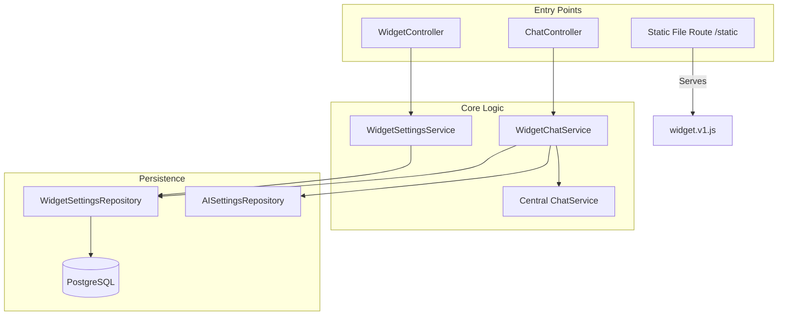
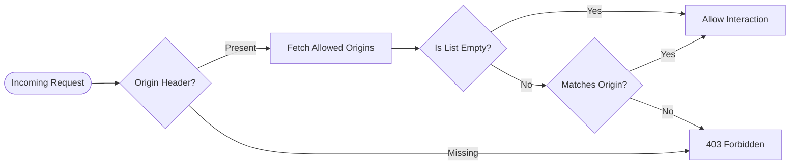
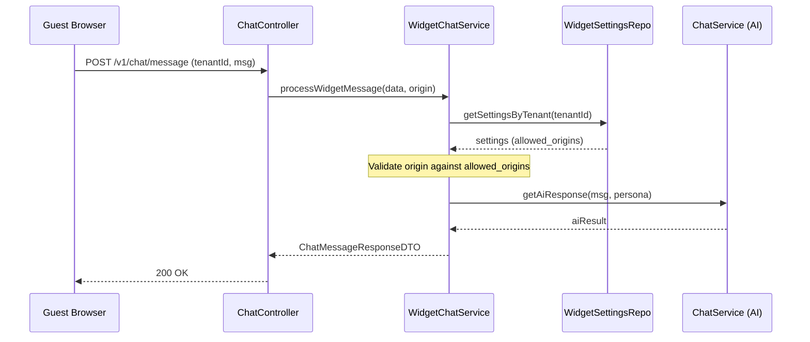

# Widget System Architecture (Backend)

The TrekDesk AI Widget backend provides the infrastructure for multi-tenant widget configuration, static asset serving, and secure guest-to-AI interaction.

## 1. Internal Component Graph

The backend is structured follow the Layered Architecture pattern (Controller -> Service -> Repository).

---

## 2. Security Model: Domain Validation

A critical feature of the widget is preventing unauthorized third-party sites from using a tenant's AI credits. This is implemented via a strict Domain validation check.

### 2.1 Validation Logic

When a message is received at the public `/api/v1/chat/message` endpoint:

1.  The `ChatController` extracts the `Origin` header from the request.
2.  The `WidgetChatService` fetches the `allowed_origins` list for the given `tenantId`.
3.  **Check 1**: If the list is empty, the widget is considered "Public" and traffic is allowed.
4.  **Check 2**: If the list contains domains, the incoming `Origin` must match one of the entries.
5.  **Bypass**: In `development` mode, this check is bypassed to allow local testing.

---

## 3. Database Schema

The widget configuration is stored in the `widget_settings` table.

### 3.1 Table Definition

| Column              | Type          | Description                           |
| :------------------ | :------------ | :------------------------------------ |
| **tenant_id**       | `UUID` (PK)   | Unique identifier for the tenant.     |
| **primary_color**   | `VARCHAR(7)`  | HEX code for brand colors.            |
| **position**        | `VARCHAR(10)` | `left` OR `right` launcher alignment. |
| **initial_message** | `TEXT`        | Greeting displayed in the widget.     |
| **allowed_origins** | `TEXT[]`      | Array of authorized domain strings.   |
| **updated_at**      | `TIMESTAMP`   | Auto-updated on configuration change. |

---

## 4. Message Processing Sequence

This diagram shows how a message from a guest is orchestrated in the backend.

---

## 5. API Endpoints

### 5.1 Administrative (Protected)

Used by the Admin Dashboard to manage settings.

- `GET /api/v1/widget/settings`: Retrieve current configuration.
- `PUT /api/v1/widget/settings`: Update configuration (Primary color, Greeting, Domains).

### 5.2 Public

Used by the embedded widget on third-party sites.

- `GET /static/widget.v1.js`: Fetches the JS loader.
- `POST /api/v1/chat/message`: Secure interaction with the AI.
