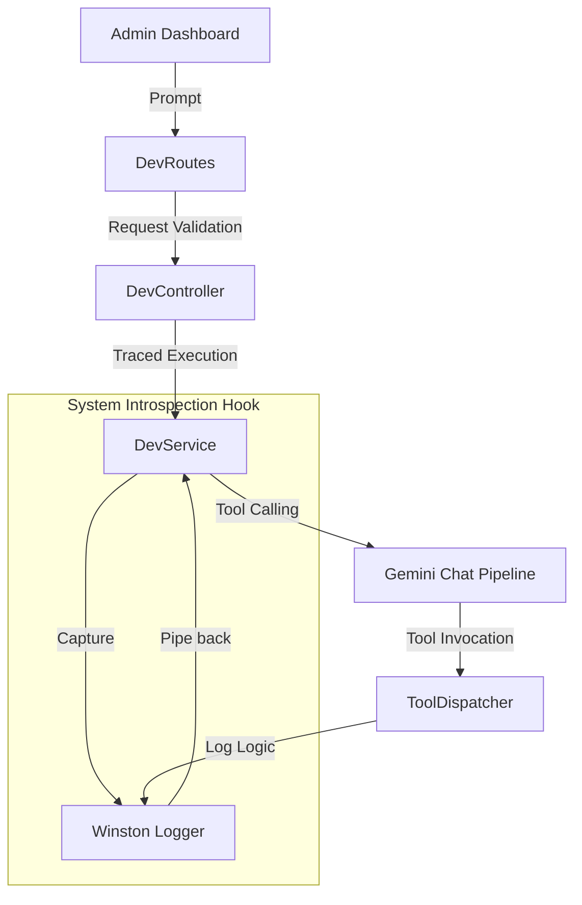
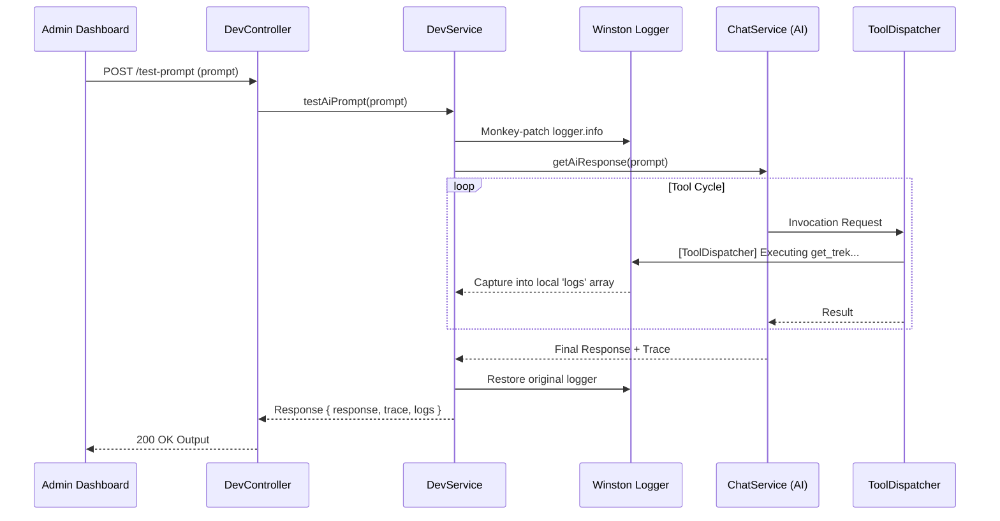

# 14 Diagnostic Tools Technical Flow

This document details the internal lifecycle of developer diagnostic requests, specifically how the backend orchestrates system introspection and tool-tracing for the AI Sandbox.

## 1. Architectural Layers

The Diagnostic Tools (`/dev`) module follows the standard TrekDesk AI layered architecture but introduces specialized **System Monitoring** hooks to capture internal execution logs.

---

## 2. Component Analysis

### 2.1 API Routes (`devRoutes.ts`)

Defines the management interface for developers.

- **Security:** Protected by `AuthMiddleware.protect` to ensure diagnostic endpoints are only accessible to authenticated administrators.
- **Endpoints:**
  - `POST /test-prompt`: Main simulation engine for tool-tracing.
  - `GET /tools`: Current registry of AI-exposed functions.
  - `GET /calendar`: Direct Google Calendar data dump.

### 2.2 Controller (`DevController.ts`)

The orchestrator for incoming diagnostic requests.

- **DTO Mapping:** Uses `TestPromptRequestDTO` to strictly type input.
- **Error Propagation:** Ensures failures in the AI pipeline are caught and sent to the global error middleware via `next(err)`.

### 2.3 Service Interface (`IDevService.ts`)

Defines the contract for diagnostic operations, facilitating abstraction and potential mocking for automated testing.

### 2.4 Service Implementation (`DevService.ts`)

The implementation is unique because it includes **Interception Logic**.

- **Logger Monkey-patching:** For the duration of a `testAiPrompt` call, the service wraps `logger.info`. This intercepts logs with specific tags (e.g., `[ToolDispatcher]`, `[BookingService]`) and redirects them into the API response.
- **Registry Access:** Reads directly from the `toolDefinitions` config to provide the AI Debugger with schema visibility.
- **Calendar Diagnostics:** Wraps `GoogleCalendarService` to provide a raw data view, helping troubleshoot sync issues.

---

## 3. Sequence: Prompt Execution Trace

## 4. Operational Considerations

- **Logger Restoration:** The `DevService` uses a `finally` block to ensure the original logger is always restored. Failing to do so would cause log duplication or memory leaks in the global scope.
- **Tenant Isolation:** All diagnostic runs are currently performed against the `MVP_TENANT_ID` and its associated system instructions to maintain consistency with production behavior.
- **Log Filtering:** To avoid overwhelming the UI, the service specifically filters for logs appearing from the `ToolDispatcher`, `BookingService`, and `TourService` domains.
