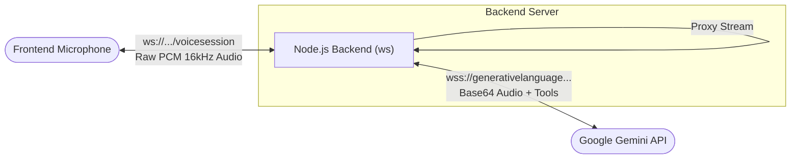
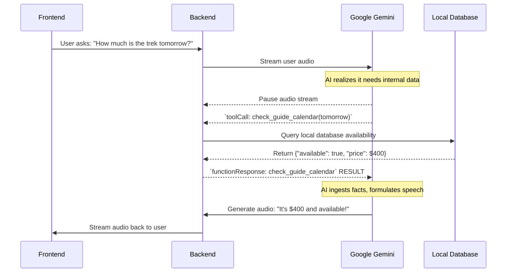

# 03 Real-time Voice AI

## Overview

The core of TrekDesk AI is its ability to conduct natural, real-time voice conversations with leads. This is powered by Google's **Gemini Multimodal Live API** connected over WebSockets.

## The WebSocket Architecture (`src/sockets/voiceSession.ts`)

Instead of standard REST HTTP calls where a user submits audio, waits for processing, and receives a response (which creates massive latency), we maintain a dual-WebSocket stream architecture:

1.  **Frontend <-> Backend (Widget to Node.js):** The frontend web widget opens a WebSocket connection to our Node backend at `ws://<server>/voicesession`. It rapidly streams raw base64-encoded PCM audio chunks as the user speaks.
2.  **Backend <-> Gemini (Node.js to Google):** Upon client connection, our `GeminiService` instantly opens a secondary WebSocket connection directly to Google's Gemini Multimodal Live API servers.

### Audio Streaming

Our backend acts as a highly efficient proxy relay. As PCM audio chunks arrive from the frontend, we use `geminiService.sendAudio` to immediately pipe them into the Google stream without waiting for the user to stop talking.

When Gemini generates spoken audio responses, it streams PCM chunks back to our backend. We detect these `serverContent.modelTurn` responses and immediately pipe them backward to the frontend to play in real-time.

## Tool Calling (Function Execution)

The Gemini model is not just a chatbot; it acts as an agent capable of taking actions.

### 1. Declaring Tools (`src/config/tools.ts`)

When opening the connection to Google, we send a JSON configuration defining functions the AI _can_ call. For example:

- `get_available_treks()` — Lists all active tours and their IDs.
- `check_guide_calendar(date: string)` — Checks availability for a specific date.
- `generate_quote(trek_id, pax, transport, negotiation_stage)` — Calculates dynamic pricing.
- `query_knowledge_base(query: string)` — Performs semantic vector search.
- `book_trek(trek_id, pax, date, customer_name, customer_phone, customer_email)` — Commits a booking to the database.

### 2. Execution Interception

If the conversational context demands it (e.g., the user asks "How much for 2 people tomorrow?"), Gemini will **pause** its audio generation and send a `toolCall` request back to our backend over the WebSocket.

### 3. Tool Dispatcher (`src/services/ToolDispatcher.ts`)

Our backend catches the `toolCall`:

1. The `ToolDispatcher` maps the requested function name to the actual Domain Service (e.g., routing `query_knowledge_base` to `KnowledgeService.search`).
2. It executes the logic locally.
3. It formats the output (e.g., "The price is $400") and sends a `functionResponse` back to Gemini.
4. Gemini seamlessly reads this injected knowledge and resumes talking, incorporating the facts into its voice response.

---

## Related Docs

- `ARCHITECTURE.md`
- `features/FEATURE_CONVERSATIONS.md`
- `features/FEATURE_PERSONA.md`
- `RAG_PIPELINE.md`
- `features/FEATURE_DIAGNOSTICS.md`
