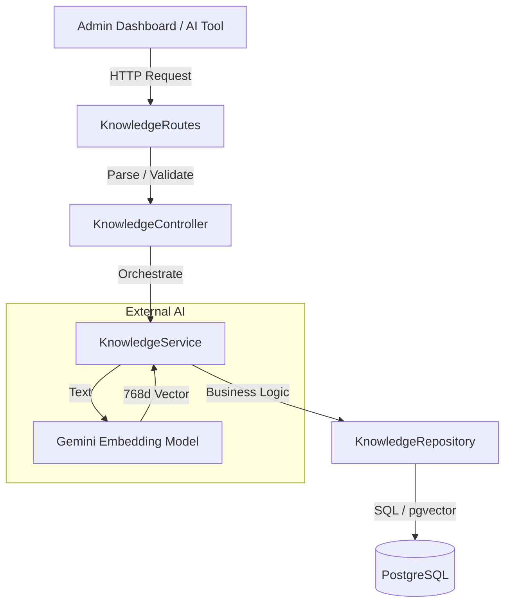
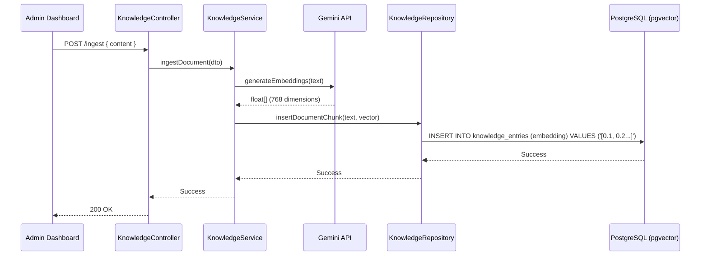

# Knowledge Base Technical Flow

This document details the internal request lifecycle for the Knowledge Base (RAG) feature, tracing a request from the public API endpoint down to the specialized vector database operations.

## 1. Architectural Layers

The Knowledge Base follows the standard layered architecture of TrekDesk AI, with specialized handling for vector embeddings and pgvector.



---

## 2. Component Breakdown

### 2.1 API Routes (`knowledgeRoutes.ts`)

Defines the REST structure and attaches Swagger documentation.

- **Security:** Requires `AuthMiddleware.protect` to ensure only authenticated tenant admins can manage knowledge.
- **Endpoints:**
  - `POST /ingest`: Inbound raw text processing.
  - `GET /search`: Diagnostic semantic search.
  - `GET /`: List all stored chunks.
  - `PATCH /:chunkId`: Content updates.
  - `DELETE /:chunkId`: Content removal.

### 2.2 Controller (`KnowledgeController.ts`)

The entry point for HTTP requests.

- **Mapping:** Extracts data from `req.body` or `req.query` and maps it to domain DTOs.
- **Response Handling:** Uses `ApiResponse` to send standardized JSON envelopes and `next(error)` for specialized error handling.

### 2.3 Service (`KnowledgeService.ts`)

The core processing engine.

- **Transformation:** Coordinates with `AIService` or direct Google SDK calls to transform strings into 768-dimensional vectors.
- **Chunking:** Implements logic to split large documents into optimized segments (standard approx. 1000 characters).
- **Tenant Isolation:** Ensures all operations are scoped to the `MVP_TENANT_ID`.

### 2.4 Repository (`KnowledgeRepository.ts`)

The specialized persistence layer.

- **pgvector Integration:** Uses raw SQL or Knex/TypeORM helpers to handle the `vector` data type.
- **Semantic Search Logic:** Uses the `<=>` (cosine distance) operator for similarity matching.
- **Query Example:**
  ```sql
  SELECT content, similarity
  FROM knowledge_chunks
  WHERE tenant_id = :tenantId
  ORDER BY embedding <=> :queryVector
  LIMIT 5;
  ```

---

## 3. Detailed Sequence: Content Ingestion



## 4. Error Handling & Validation

- **Global Interceptor:** Front-end errors are caught and formatted for user-friendly display.
- **Backend Validation:** Request bodies are strictly typed via DTOs and validated before reaching the service layer.
- **Vector Dimensions:** Safeguards in place to ensure embeddings always match the database column constraints (768d).

---

## Related Docs

- `../API_REFERENCE.md`
- `../DATABASE_SCHEMA.md`
- `../RAG_PIPELINE.md`
- `../REALTIME_VOICE_AI.md`
